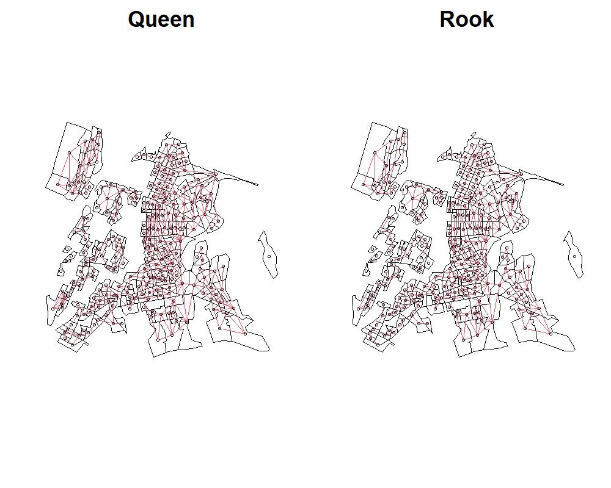

```{r, echo=FALSE, results='hide', warning=FALSE, message=FALSE}
library(tidycensus)
library(tidyr)
library(tidyverse)
library(censusapi)
library(tmap)
library(ggplot2)
library(dplyr)
library(stringr)
library(units)
library(stats)
library(grDevices)
library(dotenv)
library(sf)
library(corrr)
library(spatialreg)
library(spdep)
library(jtools)
library(huxtable)
library(GWmodel)
library(spgwr)
library(SpatialML)
library(ggthemes)
```

```{r setup, include=FALSE}
knitr::opts_chunk$set(echo = TRUE)
```

El presente documento se enfoca en el desarrollo de modelos de predicción de precios de viviendas mediante el uso de datos georreferenciados sobre los cuales aplicaremos técnicas centradas en datos espaciales y modelos de regresión adaptados para tratar la dependencia espacial que poseen estos mismos. Se hace uso del lenguaje de programación R para simulaciones, y se toma como referencia el libro [Analyzing US Census Data - Kyle Walker (2023)](https://walker-data.com/census-r/), para obtener y manipular los datos usados en el modelo. El objetivo es predecir el precio de las viviendas en una determinada ubicación utilizando datos que a su vez poseen una componente espacial, sin embargo, su uso trae consigo otros desafíos que debemos enfrentar, tales como: la autocorrelación espacial de los datos, la heterogeneidad espacial, entre otros fenómenos que expondremos, los cuales afectan suposiciones clásicas que se toman en modelos más simples de predicción, como puede ser la identica e independiente distribución de los datos o la homocedasticidad de estos. La combinación de estos conceptos permite obtener modelos precisos y útiles para la toma de decisiones, como puede ser su uso para modelos del mercado inmobiliario.

En el contexto de datos espaciales [@8444678], trabajamos con un conjunto de observaciones de datos asociados con una componente espacial $\{(x(s_i),y(s_i)) | \ i \in \mathbb{N} , 1 \leq i \leq n\}$ donde $n \in \mathbb{N}$ es la cantidad de muestras, $s_i \in \mathbb{R}^{2}$ es un vector de coordenadas espaciales, $x(s_i) \in \mathbb{R}^m$ son las variables explicativas del modelo e $y(s_i) \in \mathbb{R}$ es la respuesta a dichas variables.

Este mismo conjunto también puede ser descrito en formato matricial como $(X,Y) \in \mathbb{R}^{(m+1) \times n}$ donde $X = [x(s_1), x(s_2), \dots, x(s_n)]^{T} \in \mathbb{R}^{m \times n}$, ya que $x(s_i) \in \mathbb{R}^{m}$ e $Y = [y(s_1), y(s_2), \dots, y(s_n)]^{T} \in \mathbb{R}^{n}$.

El problema de la predicción consiste en que, dado un conjunto de muestras de data espacial, buscamos modelar una función $f$ tal que $Y = f(X) + \varepsilon$ donde $\varepsilon$ es un término para el error entre el valor real y el predecido, una vez que el modelo se entrena, minimizando el error, puede usarse para precedir la respuesta en otra locación dada sus variables explicativas.

La predicción espacial tiene una cualidad diferenciadora de la predicción usual, esto pues, en este último se asume que las muestras son independientes e identicamente distribuidas (i.i.d) y por lo tanto, dado un modelo reflejado en la función $f$ podemos usarlo para predecir $y(s) = f(x(s))$ para todo $s$, sin embargo, la suposición de que los datos son i.i.d no se cumple bajo la data espacial, esto debido a la relación implícita que existe entre posiciones cercanas en una región.

Acorde a la primera ley de la geografía de Tobler W.R: "Todo se relaciona con todo lo demás, pero las cosas más cercanas se relacionan más que las cosas distantes" [@tobler1970], este fenómeno se conoce como autocorrelación espacial, e ignorarlo puede afectar la precisión de modelos que tengan el supuesto de una muestra i.i.d, pues perdemos esta propiedad sobre los datos.

\newpage

Respecto de los desafíos presentes cuando trabajamos con métodos de predicción espacial, abordamos a lo largo del documento los siguientes:

-   $\textit{Autocorrelación espacial}$ $\rightarrow$ como indica Tobler con su primera ley de geografía, los datos espaciales no son estadísticamente independientes entre sí, al contrario estos, están correlacionados, y la intensidad de dicha relación depende de la distancia que exista entre estos, siendo mayor cuando los datos están cerca entre sí, dicho fenómeno interviene cuando usamos modelos de predicción que toman por hipótesis una distribución independiente e identica entre los datos, como es el caso de la regresión lineal.

-   $\textit{Heterogeneidad espacial}$ $\rightarrow$ cuando fragmentamos el espacio para el análisis de los datos y le asignamos a cada sector algún atributo, los datos que conforman ese sector no siguen una distribución idéntica, por lo que, la función que represente al proceso, se asume constante para las muestras que se generen sobre ese mismo sector, esto se conoce como estacionariedad, y dichas suposiciones permiten simplificar la creación de modelos, sin embargo, cuando no se cumple este principio, como es típico con datos demográficos, puede interferir en la precisión y es por ello que necesitamos técnicas que lidien con procesos no estacionarios.

Para el análisis de datos haremos uso de $\textit{tidycensus}$, paquete de R diseñado para facilitar el proceso de adquisición y manejo de datos sobre la población, proporcionados por la oficina del censo de EE.UU, acompañados de otros paquetes para el uso de modelos de predicción, visualización, entre otros.

En $\textit{Analyzing US Census Data - Kyle Walker}$ se muestra como hacer uso de las librerías, entre ellas:

-   tidycensus : Paquete de R diseñado para facilitar procesos de adquirir y trabajar data de US Census, busca distribuir los datos del censo en un formado compatible con tidyverse, además busca agilizar el proceso del tratado de datos para aquel que esté trabajando en el analisis de datos. [Ch2.](https://walker-data.com/census-r/an-introduction-to-tidycensus.html)

-   tidyverse : Coleción de paquetes de R diseñados para la ciencia de datos tales como *ggplot2* para la visualización de data, *readr* para importar y exportar bases de datos, *tidyr* para la remodelación de datos, entre otros. [Ch3.](https://walker-data.com/census-r/wrangling-census-data-with-tidyverse-tools.html)

-   tigris : Paquete de R que busca simplificar procesos para los usuarios de obtención de información y uso de data con atributos geográficos (data espacial, Census geographic dataset), data tipo *sf* (simple features) viene con atributos de geometría (vector data type, tipicamente representados por puntos lineas o poligonos). [Ch5.](https://walker-data.com/census-r/census-geographic-data-and-applications-in-r.html)

-   ggplot2 : Paquete de R enfocado en la visualización de data, nos permite realizar mapas con información de US Census data. [Ch6.](https://walker-data.com/census-r/mapping-census-data-with-r.html)

-   spatialreg & GWmodel : Paquete diseñado para la aplicación de modelos de regresión espacial

\newpage

## Importando data

Importamos datos con *tidycensus* provenientes de la American Community Survey (ACS) 5 year (2016-2020), haciendo uso de la función get_acs()

Tomamos datos con nivel geográfico de distritos para la ciudad de NY, para ello pedimos datos de los condados de: 'Bronx', 'Kings', 'New York', 'Queens', 'Richmond'

```{r, echo=FALSE, results='hide', warning=FALSE, message=FALSE}
#package
library(dotenv)
library(sf)
library(tidycensus)
library(dplyr)

# Variable: Condados que forman NYC
nyc_counties <- c("Bronx","Kings","New York","Queens","Richmond")

# Lista de regresores a utilizar
variables_to_get <- c(
  median_value = "B25077_001",
  median_rooms = "B25018_001",
  median_income = "DP03_0062",
  total_population = "B01003_001",
  median_age = "B01002_001",
  pct_college = "DP02_0068P",
  pct_foreign_born = "DP02_0094P",
  pct_white = "DP05_0077P",
  pct_black = "DP05_0078P",
  pct_hispanic = "DP05_0070P",
  pct_asian = "DP05_0080P",
  percent_ooh = "DP04_0046P"
)
```

```{r, results='hide', warning=FALSE, message=FALSE}
# Obtiene datos de la ACS y transforma a tipo NYC EPSG
nyc_data <- get_acs(
  geography = "tract",
  variables = variables_to_get,
  state = "NY",
  county = nyc_counties,
  geometry = TRUE,
  output = "wide",
  year = 2020,
  key = Sys.getenv("CENSUS_API")) %>% 
  st_transform(2263)

```

Las variables que importamos, y que usaremos para los modelos de predicción, son las siguientes:

-   **median_value** : El valor medio de la vivienda del tramo censal, nuestra variable a predecir

-   median_rooms : Cantidad media de habitaciones por casa en el tramo censal

-   total_population : Población total en el tramo censal

-   median_age : Edad media de la población en el tramo censal

-   median_year_built : Año promedio donde se construyó la vivienda

-   median_income : Ingreso medio de los hogares en el tramo censal

-   pct_college : Porcentaje de la población de 25 años o más con un título universitario de cuatro años

-   pct_foreign_born: Porcentaje de la población que nació fuera de EE.UU

-   pct_white : Porcentaje de la población que se identifica como blanco no-hispano, se sigue la misma lógica con pct_black, pct_asian, pct_hispanic.

-   percent_ooh : El porcentaje de unidades de vivienda en el tramo censal que están ocupadas por sus propietarios.

Los detalles para descargar información de las distintas bases de datos que proporciona *tidycensus* y las distintas variables que tenemos a disposición se encuentran en el **Anexo 3**.

Más detalles sobre la estructura del código se encuentran en la sección 8.2.1 de *Analyzing US Census Data*, en el libro se toma la misma variable "median home value", pero a diferencia de nuestro caso, se toman los tramos censales en Dallas-Fort Worth metropolitan area, en consecuencia también cambian el código usando en st_transform, a un sistema de referencias apropiado para North Texas (code 32148), a diferencia del caso NYC donde usamos code 2263

\newpage

## Preparando la data para modelar

Ya que hemos importado los datos, realizamos una limpieza de estos (data scrubbing), identificando datos incompletos, incorrectos o inexactos.

Antes de esta tarea, veamos un resumen de los datos, mostrando sus estadísticos principales, tales como mínimo, máximo, promedio, mediana, cuartiles y valores perdidos.

```{r, echo=FALSE, results='hide', warning=FALSE, message=FALSE}
resumen_nyc <- data.frame(unclass(summary(nyc_data)), check.names = FALSE, stringsAsFactors = FALSE)
resumen_nyc <- resumen_nyc[,-1:-2]
resumen_nyc
```

```{r, echo = FALSE, fig.align = 'center', out.width="100%"}
knitr::include_graphics("image/estadisticas.png")
```

La recolección de datos incluye para cada variable otra columna asociada que representa el margen de error de los datos (aquellas que terminan en 'M'), sin embargo, no haremos uso de ello y por tanto la eliminamos del modelo.

Nuestra variable dependiente para los modelos de regresión será el valor promedio de la vivienda en NYC, esta la importamos bajo el nombre de median_value.

Podemos visualizarla haciendo uso del paquete *tmap*, para ello es importante activar la opción de geometría, esto permite descargar las componentes espaciales de los distritos asociados a los datos como objetos tipo *polygon*.

```{r, echo=FALSE, results='hide', warning=FALSE, message=FALSE, out.width='80%', fig.align = 'center'}
# plot tmap
(nyc_median_value_hist_tm <- nyc_data[!st_is_empty(nyc_data),,drop=F] %>% 
tm_shape() +
  tm_polygons(col = "median_valueE",
          palette = "cividis",
          title = "2016-2020 ACS",
          legend.hist = TRUE,
          legend.format = scales::dollar_format()) +
  tm_layout(main.title = "NYC Median Home Value",
            frame = FALSE,
            legend.outside = TRUE,
            bg.color = "grey100",
            legend.hist.width = 5,
            ))

# save plot
tmap_save(nyc_median_value_hist_tm, "image/nyc_median_value.png", width=1920, height=1080, asp=0)
```

\newpage

Notamos en el histograma que se presenta una asimetría a la derecha, i.e, existe una población no menor cuyas viviendas poseen un valor mucho mayor a la mediana, usualmente es más facil trabajar con la variable dependiente distribuida como una gaussiana, para ello podemos aplicar una transformación raíz cuadrada, por otro lado tenemos datos sin información, para esto aplicamos herramientas de R para el filtrado.

La distribución de la variable dependiente aplicada esta transformación se ve de la siguiente manera

```{r, echo=FALSE, results='hide', warning=FALSE, message=FALSE, out.width='75%', fig.align = 'center'}

# Creamos plot
(nyc_median_value_sqrt_hist_tm <- nyc_data[!st_is_empty(nyc_data),,drop=F] %>%
   
# Limpiamos datos vacios
mutate(sqrt_med_value = sqrt(median_valueE)) %>% #variable_sqrt
tm_shape() +
  tm_polygons(col = "sqrt_med_value",
          palette = "cividis",
          title = "2016-2020 ACS (sqrt)",
          legend.hist = TRUE) +
  tm_layout(main.title = "NYC Median Home Value by Census Tract",
            frame = FALSE,
            legend.outside = TRUE,
            bg.color = "grey100",
            legend.hist.width = 5,
            ))

# save plot
tmap_save(nyc_median_value_sqrt_hist_tm, "image/nyc_median_value_sqrt.png", width=1920, height=1080, asp=0)
```

Eliminamos aquellas variables con data NA, y aquellas columnas con información del margen de error, por lo demás, como tenemos la cantidad de población, y el área que cubre cada distrito (polygon), creamos la variable pop_density, esto pues buscamos transformar la información de la población por distrito de manera que represente mejor la relación que tiene con la variable de salida, en este caso, el valor medio de la vivienda

-   pop_density $\rightarrow$ mide densidad de población en el tramo censal por metros cuadrados

```{r, warning=FALSE, message=FALSE}
# Preparando la data
nyc_data_prepped <- nyc_data %>% 
  mutate(pop_density = as.numeric(set_units(total_populationE / st_area(.),
 "1/km2"))) %>% 
  select(!ends_with("M")) %>% # Eliminamos columnas de margen de error
  rename_with(.fn = ~str_remove(.x, "E$")) %>% 
  na.omit() # Elimina valores NA

```

Para ver como visualizar los datos haciendo uso de la geometría incorporada por *tidycensus*, ver **Anexo 4** en donde se hace una introducción de los paquetes y la sintaxis.

\newpage

## Regresión lineal y autocorrelación espacial

En esta sección, veremos como la autocorrelación espacial presente en los datos afecta la predicción en modelos cuyas hipótesis requieren de una muestra distribuida de manera identica e independiente.

Complementamos con el Capítulo 8 del libro [Analyzing US Census Data - Modeling US Census Data](https://walker-data.com/census-r/modeling-us-census-data.html) (Walker K., 2023)[@walker2023a] , capítulo donde se estudian conceptos durante la primera sección como indices de segregación y diversidad los cuales son usados en ciencias sociales para explicar patrones demográficos, en la segunda sección se estudian tópicos en modelamiento estadístico, incluyendo métodos de regresión con atributos espaciales, en donde tomamos en cuenta conceptos como la autocorrelación espacial que está inherente en la mayoría de las variables del censo; en la tercera sección del capítulo se estudian conceptos como clasificación, clusterización y regionalización, que son comunes en técnicas de Machine Learning. Nos enfocamos en particular en la segunda sección del capítulo.

### Simple Linear Regression

Con la data preparada, podemos crear el primer modelo sencillo de regresión lineal, con la variable dependiente, la raiz cuadrada del valor medio de la vivienda ("NYC Median Home Value")

```{r, results = 'hide'}
# Fórmula entre variables dependientes y regresores
formula <- "sqrt(median_value) ~ median_rooms + median_income + 
pct_college + pct_foreign_born + pct_white + pct_black + pct_hispanic + 
pct_asian + median_age + percent_ooh + pop_density"

# Regresión lineal mediante lm
model1 <- lm(formula = formula, data = nyc_data_prepped)
summary(model1)
```

```{r, echo = FALSE, fig.align = 'center', out.width="100%"}
# Coeficientes del modelo
#summary(model1)
knitr::include_graphics("image/lmmodel.png")
```

\newpage

Aquellas variables con mayor p-value son pct_foreign_born, median_age, pop_density, un p valor alto nos dice que la variable no tiene mucha significancia en el resultado (típicamente pedimos que sea menor a 0.05 para que la variable se considere significativa), notamos tambien que las primeras dos variables se correlacionan negativamente con median_value, es decir, a mayor cantidad de nacidos extranjeros y edad promedio, se tiene que el valor medio de la vivienda disminuye. Al contrario, si aumenta la densidad poblacional, notamos que el valor medio de la vivienta aumenta, podemos ver tambien el valor $R^2$ el cual nos dice que un $0.4124$% de la varianza de median_value es explicado con las variables del modelo (el modelo es deficiente).

En la regresión lineal, los errores no son independientes en un modelo con componentes espaciales, esto es porque la autocorrelación espacial está presente en el error, lo que nos dice que el performance del modelo depende de la posición geográfica.

Haciendo uso de la librería $\textbf{corrr}$ podemos calcular la matriz de correlaciones [@walker2023a]

```{r, warning=FALSE, message=FALSE}
library(corrr)

nyc_estimates <- nyc_data_prepped %>%
  select(-GEOID, -median_value ) %>%
  st_drop_geometry()

correlations <- correlate(nyc_estimates, method = "pearson")

correlations[is.na(correlations)] <- 0

```

```{r, echo = FALSE, fig.align = 'center', out.width="85%"}
# view model statistics
knitr::include_graphics("image/correlations.png")
```

\newpage

Y lo visualizamos haciendo uso de network_plot()

```{r}
network_plot(correlations)
```

\newpage

Nos interesa además los residuos del modelo, pues esperamos que estos sean explicados cuando tomamos en cuenta el fenómeno de spatial autocorrelation , para obtenerlos y añadirlos a nuestra data, seguimos como en la sección 8.3 de Analyzing US Census Data

```{r}
#Añadimos los residuos a la data que estamos trabajando
nyc_data_prepped$residuals <- residuals(model1)

#Plot
ggplot(nyc_data_prepped, aes(x = residuals)) + 
  geom_histogram(bins = 100, alpha = 0.5, color = "navy",
                 fill = "navy") + 
  theme_minimal()
```

Usaremos esta variable para realizar posteriormente un Test de Índice de Moran, para ello necesitamos hablar sobre lo que es Spatial data, el fenómeno de Spatial autocorrelation y el índice de Moran.

\newpage

### Índice de Moran

Para hacer frente al problema de la autocorrelación espacial hacemos uso del índice de Moran $I$ [@8444678] [@nikparvar2021], coeficiente nos entrega una medida de como se comporta este fenómeno para $n$ observaciones de una misma variable donde cada observación posee una componente espacial.

Definimos el índice de Moran como

$$I = \frac{\sum_{i=1}^{n} \sum_{j=1}^{n} w_{ij} (y(s_i) - \bar{y})(y(s_j) - \bar{y})}{(\sum_{i=1}^{n} \sum_{j=1}^{n} w_{ij}) \sum _{i=1}^{n} (y(s_i) - \bar{y})^2 /n }$$

O de manera equivalente

$$= \frac{n}{W}\frac{\sum_{i=1}^{n} \sum_{j=1}^{n} w_{ij} (y(s_i) - \bar{y})(y(s_j) - \bar{y})}{\sum _{i=1}^{n} (y(s_i) - \bar{y})^2}$$

donde $\bar{y} = \sum_{i=1}^{n} y(s_i)/n$ con $n$ el número total de muestras, a partir de ahora, para simplificar la notación, $y(s_i) = y_i$, además $W = \sum_{i=1}^{n} \sum_{j=1}^{n} w_{ij}$, y abusando de la notación, $W = (w_{ij})_{i,j = 1}^{n}$, que consideramos como una $\textbf{matriz de pesos estandarizada}$.

Dada su estructura, vemos que el índice de Moran es una auto-covarianza espacial estandarizada [@chen2013].

Entenderemos por $\textbf{matriz de pesos estandarizada}$ aquella que cumple las siguientes propiedades

-   Supondremos $w_{ij} \geq 0 \ \  \forall i,j \in \{1, \dots, n\}$, pues $w\_{ij}$ es una magnitud de la influencia que hay entre los vecinos $i$ y $j$

-   Típicamente, $w_{ii} = 0 \ \ \forall i \in \{1, \dots, n\}$, pues el hecho de tener que un punto tenga influencia con el mismo puede generar ruido en el modelo

-   Suponemos que la influencia que tiene $y_{i}$ sobre $y_{j}$ es la misma que la de $y_{j}$ sobre $y_{i}$, esto es, $w_{ij} = w_{ji} \ \ \forall i,j \in \{1, \dots, n\}$, es decir, $W$ es simétrica

-   \textit{Row-normalized:} Para cada $i \in \{1,\dots,n\}$ se tiene que $\sum_{j=1}^{n} w_{ij} = \alpha$ para algún $\alpha \in \mathbb{R}$, esto pues, entendemos la suma $\sum_{j=1}^{n} w_{ij}$ como la influencia total que existe entre el vecino $i$ y todos sus vecinos $j$, por lo que pedimos que la influencia total sea la misma para cada vecino $i \in \{1,\dots,n\}$, de manera que el nivel de influencia esté estandarizado para cada vecino.

Comentando sobre el significado de este valor, al igual que la correlación, en donde vemos la relación entre 2 variables de entrada cuando vemos el cambio que tienen respecto de una variable de respuesta, la autocorrelación es similar pero la variable de respuesta es la misma variable de entrada [(Fuente)](https://www.statisticshowto.com/morans-i/).

\newpage

El índice de Moran mide que tan similar es una variable respecto de las variables cercanas, por ejemplo, si este se acerca a $-1$ nos dice que cada variable tiende a tener valores distinto de sus alrededores, y caso contrario si se acerca a $1$, resumiendo

-   $I \approx -1 \rightarrow$ Se clusterizan valores distintos entre sí (dispersión perfecta)

-   $I \approx 0 \rightarrow$ No existe autocorrelación espacial (podemos pensar que los datos son independientes identicamente distribuidos en el espacio)

-   $I \approx 1 \rightarrow$ Se clusterizan valores similares entre sí

```{r, echo = FALSE, fig.align = 'center', out.width="100%"}

```

\newpage

### Spatial Weights Matrix

Seguimos el modelo, para esta parte nos guiamos con el capítulo 7 [Analyzing US Census Data - Spatial analysis with US Census Data](https://walker-data.com/census-r/spatial-analysis-with-us-census-data.html)

Buscamos armar una matriz de pesos, para medir la interacción entre cada tramo censal, para ello generamos una "neighborhood list" en R con el paquete $\textbf{spdep}$ usando la función poly2nb(), esta función nos presenta varias formas de catalogar a los vecinos, para el modelo usaremos

-   $\textit{Contiguity-based neighbors} \rightarrow$ se usa cuando la geometría es tipo polygon, las opciones incluyen neighbors tipo "Queen", que se basa en que todos los polygons que compartan un vértice se consideren vecinos, y neighbors tipo "Rook", en donde deben compartir al menos un segmento de linea para ser vecinos, podemos inferir que neighbors tipo "Queen" abre diagonales de manera que tiene menos entradas iguales a cero

```{r, results='hide', warning=FALSE, message=FALSE}
# create neighbor list object
nyc_nb <- spdep::poly2nb(nyc_data_prepped, queen = TRUE)
nyc_nb
```

```{r, echo = FALSE, fig.align = 'center', out.width="100%"}
knitr::include_graphics("image/neighborlist.png")
```

Interpretamos la información de la siguiente manera

-   Tenemos 1967 distritos censales en NYC (aquellos con valor NA se omiten)

-   El porcentaje de las entradas $w_{i,j}$ tales que $w_{i,j} \neq 0$ es $0.276$%

-   El número promedio de conexiones entre distritos censales, el promedio de cuantas conexiones posee cada distrito es $5.44$

-   Existen 5 distritos que no se conectan con nadie.

\newpage

Podemos hacer un plot de la estructura que posee el objeto "neighborhood list", para visualizarlo usamos funciones descritas en Analyzing US Census.

```{r, results='hide', warning=FALSE, message=FALSE}

# Filtramos para visualizar condado de Bronx
bronx <- nyc_data_prepped[str_detect(nyc_data_prepped$NAM, "Bronx"),]

# Guardamos su geometría (polygons)
bronx_geom <- st_geometry(bronx)

# Centroide de cada tramo censal y coordenadas
bronx_centroids = st_centroid(bronx_geom)
bronx_coordinates = st_coordinates(bronx_geom)

# Creamos neighbor list
bronx_nb_queen <- spdep::poly2nb(bronx)
bronx_nb_rook <- spdep::poly2nb(bronx, queen=FALSE)

```

```{r, results='hide', warning=FALSE, message=FALSE}
# save plot 
jpeg("image/bronx_neighborhood_rook_queen.jpg", width = 1000, height = 800)

# Preparamos plot 
par(mfrow = c(1,2))

# plot modelo queen
plot(bronx_geom,
     main = "Queen",
     reset = FALSE,
     cex.main = 3)
plot(bronx_nb_queen, bronx_centroids,
     add = TRUE,
     col = 2,
     lwd = 1.5)

# plot modelo rook
plot(bronx_geom,
     main = "Rook",
     reset = FALSE,
     cex.main = 3)
plot(bronx_nb_rook, bronx_centroids,
     add = TRUE,
     col = 2,
     lwd = 1.5)

# close jpeg
dev.off()
```

\newpage

Guardada la imagen con las conexiones entre cada distrito censal con los modelos "Queen" y "Rook" procedemos a mostrar los plots.

```{r, echo = FALSE, fig.align = 'center', out.width="80%"}

```

En efecto, observamos la presencia de conexiones diagonales para el modelo "Queen" a diferencia de la estructur de "Rook", así como en ajedrez, la reina puede moverse en todas direcciones, mientras que la torre solo puede moverse en vertical y horizontal.

\newpage

### Test de Índice de Moran

Dadas la "neighborhood list" antes dada, podemos usarla para crear una matriz de pesos (spatial weights list) $W$ usando la función de spdep nb2listw(), que nombramos wts, además para realizar el test de Índice de Moran, necesitamos ignorar aquellos datos que no posean vecinos, para ello usamos la librería spatialreg para verificar que se tiene activado la opción zero.policy que nos permite ignorar estos datos.

```{r, results='hide', warning=FALSE, message=FALSE}
# create spatial weights matrix
library(spatialreg)
library(spdep)
set.ZeroPolicyOption(TRUE)
get.ZeroPolicyOption()
wts <- spdep::nb2listw(nyc_nb)
```

Visualizando a wts

```{r, echo = FALSE, fig.align = 'center', out.width="80%"}
knitr::include_graphics("image/matrix.png")
```

Vemos que es una matriz cuyas filas tienen por suma total 1 (row normalized)

\newpage

Con ella podemos realizar un test de Índice de Moran para observar autocorrelación espacial, para ello hacemos uso de la variable de residuos obtenida en secciones anteriores

```{r, results = 'hide'}
# perform Moran's I test 
spdep::moran.test(nyc_data_prepped$residuals, wts)
```

```{r, echo = FALSE, fig.align = 'center', out.width="85%"}
knitr::include_graphics("image/moranlm.png")
```

Notamos el p-value $< 2.2e-16$ lo que nos habla de la significancia que posee en el modelo

Además, vemos que el índice de Moran tiene un valor positivo, lo que nos dice que en el mapa, distritos censales con atributos similares tienden a agruparse (clusters).

En efecto, podemos apreciar como en NYC, con la variable "Median Home Value" se forman agrupaciones de distritos en ciertos sectores del estado que comparten la cualidad de tener un alto valor de la vivienda, y a su vez, otros sectores con distritos que comparten tener un bajo nivel de la vivienda.

Un índice de Moran de $I = 0.345$ es estadísticamente significativo (Walker K., 1970)[@walker2023a]

\newpage

Observamos los residuos, hacemos uso de la función lag.listw() la cual nos toma en cuenta los residuos del modelo junto a la matriz de peso que estamos añadiendo.

```{r, warning=FALSE, message=FALSE}
# get lagged version of residuals for plot
nyc_data_prepped$lagged_residuals <- 
lag.listw(wts, nyc_data_prepped$residuals)

# plot
(morans_i_res <- nyc_data_prepped %>% 
ggplot(aes(x = residuals, y = lagged_residuals)) + 
  theme_minimal() + 
  geom_point(alpha = 0.5) + 
  geom_smooth(method = "lm", color = "red"))

# save image
ggsave("image/morans_i_res.png",
       plot = morans_i_res)
```

\newpage

El plot muestra una correlación positiva entre el fenómeno de autocorrelación espacial y los residuos, lo que sugiere rechazar la independencia en los términos del error pue s existe autocorrelación espacial en los residuos.

Para trabajar este problema, tenemos métodos para tratar con regresión espacial

## Spatial Regression Model

En está sección se aplica el dataset junto a 5 modelos distintos de regresión espacial con los diferentes paquetes que proporciona R.

Cada uno de ellos son adaptaciones de distintas técnicas de Machine Learning para hacer frente a los problemas asociados a data espacial.

### Simultaneous Autoregressive (SAR) models

Los siguientes dos modelos SAR que vienen incluidos en el paquete $\textbf{spatialreg}$ se enfocan en añadir términos para abordar la autocorrelación espacial

-   spatialreg::lagsarlm() $\rightarrow$ da cuenta de la dependencia espacial al incluir un "spatial lag" de la variable dependiente (outcome) del modelo. Esto explica los efectos indirectos espaciales de los valores de los vecindarios (neighboring areas) que influyen en los valores dentro de una ubicación determinada.

-   spatialreg::errorsarlm() $\rightarrow$ incluye "spatial lag" en el la medida del error del modelo. Esto está diseñado para capturar procesos espaciales latentes que no se tienen en cuenta en la estimación del modelo y, a su vez, aparecen en los residuos del modelo.

A pesar de que estos modelos dan cuenta de la autocorrelación espacial, asumen que todos los coeficientes son iguales y, por lo tanto, no abordan la heterogeneidad espacial (spatial heterogeneity) que es otra problemática asociada a la data espacial como se vió en secciones anteriores. Por el contrario, el método Geographically Wighted Regression (GWR) toma en cuenta la heterogeneidad espacial.

\newpage

### Geographically Weighted Regression (GWR)

Los siguientes dos modelos abordan la heterogeneidad espacial mediante GWR, aprendiendo un conjunto de parámetros del modelo en cada ubicación. Los inconvenientes son el coste computacional y la suposición de "spatial isotropy". La isotropía espacial es la suposición de que, independientemente de la dirección en que nos movamos, las propiedades son las mismas.

-   GWModel::gwr.basic() $\rightarrow$ modelo simple de regresión ponderada geográficamente (geographically weighted regression) diseñado para evaluar las variaciones locales en los resultados de los modelos de regresión dada una función de pesos. Típicamente funciones que decaen con la distancia.

-   spgwr::gwr() $\rightarrow$ implementa el enfoque básico de regresión ponderada geográficamente (GWR) para explorar la "no estacionariedad espacial" para un ancho de banda global dado y un esquema de ponderación elegido (weighting scheme).

### Geographically Weighted Random Forest (GRF)

El siguiente modelo aborda la heterogeneidad espacial o, más específicamente, la "no estacionariedad" espacial de los datos, mediante el uso de una versión local de algoritmos de Machine Learning. Según la documentación del paquete, la diferencia entre un GWR lineal y un GRF es que podemos modelar la "no estacionariedad" junto con un modelo no lineal, lo que vuelve menos restríctiva la función que queremos modelar.

-   SpatialMl::grf() $\rightarrow$ implementa una extensión espacial del algoritmo de Random Forest (RF) que incluye un "bosque aleatorio ponderado geográficamente" en un conjunto de modelos locales.

\newpage

## Aplicación de modelos espaciales

### SAR models

$$ Y = \alpha + \rho WY + X \beta + \varepsilon$$

$$Y_i = \alpha_i + \rho Y_{lag-i} + \sum_{k} \beta_k X_{ik} + \varepsilon_i$$

$$Y_{lag-i} = \sum_{j}w_{ij} Y_j$$ Errormodel

$$ Y_i = \alpha \sum_{k} \beta_{k}X_{ik} + u_i$$ donde

$$u_i = \lambda u_{lag-i} + \varepsilon_i$$ y

$$u_{lag-i} = \sum_{j} w_{ij} u_{j}$$

Con el paquete $\textbf{spatialreg}$ hacemos uso de lagsarlm(), el formato para crear el modelo es similar a los usados en SLR, usamos como parámetro listw (spatial weights list) nuestra variable wts creada para el test de índice de Moran.

```{r, results = 'hide'}
# lag model
lag_model <- spatialreg::lagsarlm(
  formula = formula, 
  data = nyc_data_prepped, 
  listw = wts,
  zero.policy=TRUE #Importante  omitir valores NA
)

summary(lag_model, Nagelkerke = TRUE)
```

```{r, echo = FALSE, fig.align = 'center', out.width="80%"}
knitr::include_graphics("image/lagsarlm.png")
```

\newpage

Por otra parte, usando errorsarlm()

```{r, results='hide'}
# error model
error_model <- spatialreg::errorsarlm(
  formula = formula, 
  data = nyc_data_prepped, 
  listw = wts,
  zero.policy=TRUE
)

summary(error_model, Nagelkerke = TRUE)
```

```{r, echo = FALSE, fig.align = 'center', out.width="85%"}
knitr::include_graphics("image/errormodellm.png")
```

\newpage

Podemos hacer una comparación entre el primer modelo SLR y estos dos nuevos modelos usando el paquete $\textbf{jtools}$ y $\textbf{huxtable}$ usando la función export_summs()

```{r, results='hide', message=FALSE, warning=FALSE}
#compare simple linear model with SAG models
library(jtools)
library(huxtable)
jtools::export_summs(model1, lag_model, error_model)
```

```{r, echo = FALSE, fig.align = 'center', out.width="85%"}
knitr::include_graphics("image/modelcomparing.png")
```

Notamos que en cuando al test de $R^2$, estadística que mide la proporción de varianza de la variable dependiente explicada por las variables independientes que usamos en el modelo de regresión, se tiene acorde al desempeño

-   Model 1 - lm() $\rightarrow R^2 = 0.46$

-   Model 2 - spatialreg::lagsarlm() $\rightarrow R^2 = 0.63$

-   Model 3 - spatialreg::errorsarlm() $\rightarrow R^2 = 0.65$

\newpage

### Test de índice de Moran con modelos auto-regresivos (SAR)

Dada las propiedades de estos modelos, esperamos una disminución del efecto de autocorrelación espacial en los residuos del modelo, los resultados son los siguientes

#### Lag model

```{r, results = 'hide'}
# lag model Moran's I test
spdep::moran.test(lag_model$residuals, wts)
```

```{r, echo = FALSE, fig.align = 'center', out.width="100%"}
knitr::include_graphics("image/moran_lagmodel.png")
```

#### Error model

```{r, results='hide'}
# error model Moran's I test
spdep::moran.test(error_model$residuals, wts)
```

```{r, echo = FALSE, fig.align = 'center', out.width="85%"}
knitr::include_graphics("image/error_moran.png")
```

Notamos que en ambos modelos se minimiza el valor que toma el índice de Moran, el p-valor aumenta considerablemente sobre $p>0.05$, lo que disminuye la significancia de la autocorrelación del modelo. En partícular error_model tiene mejor desempeño haciendo frente a la autocorrelación espacial en comparación a lag_model.

\newpage

### GWR models

Estudiamos dos modelos de regresión ponderada geográficamente (GWR). Estos modelos abordan el problema de la heterogeneidad espacial aprendiendo un modelo distinto en cada ubicación de punto de datos, creando así parámetros de modelo dependientes de la ubicación.

#### GWModel

Primero tenemos el modelo gwr.basic() del paquete GWmodel. El preprocesamiento consiste en convertir el conjunto de datos en un objeto SpatialPolygons sp (no admite objetos sf) y en seleccionar un "bandwidth" (ancho de banda). El concepto de "kernel bandwidth" se utiliza en GWR para calcular un modelo de regresión local para cada tramo censal. Se basa en el tipo de kernel, fijo o adaptativo, y en una función que decae con la distancia. El kernel adaptativo utiliza los vecinos más próximos de cada sección censal, mientras que el kernel fijo utiliza una distancia de corte.

La función de reducción de la distancia determina la ponderación de las observaciones con respecto a cada dato. Dado que el tamaño de las secciones censales varía, es preferible utilizar un núcleo adaptativo, ya que garantiza la coherencia de los barrios de toda la región [Spatial Machine Learning - J. Morgan](https://justinmorganwilliams.medium.com/spatial-machine-learning-29137dcd1f5f).

```{r, results='hide', message=FALSE}
library(GWmodel)
library(sf)
library(tidyverse)

# convert to sp object
nyc_data_prepped_sp <- nyc_data_prepped %>%
  as_Spatial()

# choose bandwidth
bw <- bw.gwr(
  formula = formula, 
  data = nyc_data_prepped_sp, 
  kernel = "bisquare",
  adaptive = TRUE
  )
  
  # run model
  gw_model <- gwr.basic(
  formula = formula, 
  data = nyc_data_prepped_sp, 
  bw = bw,
  kernel = "bisquare",
  adaptive = TRUE
  )
  
  # save results
  gw_model_results <- gw_model$SDF %>%
  st_as_sf() 

```

\newpage

Para ver el $R^2$ del modelo, escribimos

```{r}
# global R2 of gwr.basic from GWModel
gw_model$GW.diagnostic$gw.R2
```

Podemos observar una medida local del $R^2$ para visualizar en que lugares el modelo posee un mejor desempeño.

Primero tenemos que añadir los datos R2 locales al objeto sp. Después de esto podemos utilizar el paquete tmap para crear un mapa para el modelo GWRmodel de salida.

```{r}
# gwmodel add to sp object
nyc_data_prepped_sp$gwmodel <- gw_model$SDF$Local_R2

# gwmodels
nyc_gw_model <- tm_shape(nyc_data_prepped_sp) +
  tm_fill("gwmodel", 
          palette = "RdBu", 
          title = "Local R2") +
  tm_layout(main.title = "GWR [GWModel] Local R2")
nyc_gw_model
```

\newpage

#### GWR spgwr

Utilizaremos la función spgwr gwr() para comparar una GWR con la versión del GWmodel. Aquí, si pasamos a la función un objeto sp, no necesitamos pasarle coordenadas.

```{r, results='hide', message=FALSE}
library(spgwr)

# choose bandwidth
bw2 <- gwr.sel(formula = formula, 
               data = nyc_data_prepped_sp,
               adapt = TRUE,
               gweight = gwr.bisquare,
               method = "cv",
               verbose = TRUE)
               
# run model               
spgwr_model <- gwr(formula = formula, 
            data = nyc_data_prepped_sp,
            adapt = bw2,
            gweight = gwr.bisquare, 
            hatmatrix = TRUE)
```

En este caso, el modelo arroja un R2 "cuasiglobal", que debemos calcular. Basta con restar 1 a la división de las sumas de cuadrados residuales (RSS) entre las sumas de cuadrados totales (TSS):

```{r}
# calculate quasi-global R2
spgwr_model$LocalR2 <- (1 - (spgwr_model$results$rss/spgwr_model$gTSS))
```

\newpage

Hacemos lo mismo que antes con la visualización GWModel

```{r}
# load packages
library(tmap)

# spgwr add to sp object
nyc_data_prepped_sp$spgwr <- spgwr_model$SDF$localR2

# spgwr
nyc_spgwr <- tm_shape(nyc_data_prepped_sp) +
  tm_fill("spgwr", 
          palette = "RdBu", 
          title = "Local R2") +
  tm_layout(main.title = "GWR [spgwr] Local R2")

nyc_spgwr
```

\newpage

### Geographically Weighted Random Forest (GRF)

#### SpatialML

Por último, utilizamos el paquete SpatialML para aplicar el modelo de bosque aleatorio (random forest) ponderado geográficamente grf() al conjunto de datos. Este modelo necesita que se le pase como argumento un objeto de coordenadas.

Este modelo es diferente del clásico random forest, ya que se construye un submodelo para cada ubicación de datos teniendo en cuenta sólo las observaciones cercanas. Estas observaciones cercanas se deciden por la selección del "bandwidth" óptimo. Sin embargo, este proceso consume mucho tiempo, por lo que se escoge aleatoriamente un número para el bandwidth (98).

Escribimos el código para implementar grf()

```{r, results='hide', message=FALSE}
#packages
library(SpatialML)
library(sf)
library(tidyverse)

# get centroids from each geom
nyc_data_prepped <- nyc_data_prepped %>% 
  mutate(lon = map_dbl(geometry, ~st_centroid(.x)[[1]]),
         lat = map_dbl(geometry, ~st_centroid(.x)[[2]]))

# create coords column
coords <- nyc_data_prepped %>% 
  st_drop_geometry() %>% 
  select(lat,lon)

# prep for grf
nyc_grf_prepped <- nyc_data_prepped %>% 
  st_drop_geometry() %>%
  mutate(sqrt_med_value = sqrt(median_value)) %>% 
  select(!c(GEOID, NAM, residuals, lagged_residuals, lat, lon))

# Definimos formula para grf
formula_grf <- "sqrt_med_value ~ median_rooms + median_income + 
pct_college + pct_foreign_born + pct_white + pct_black + 
pct_hispanic + pct_asian + median_age + percent_ooh  + 
pop_density"


# get optimal bandwidth
bwgrf <- grf.bw(formula = formula_grf,
                dataset = nyc_grf_prepped,
                kernel = "adaptive",
                coords = coords,
                bw.min = 98,
                bw.max = 98,
                step = 1,
                trees = 500,
                mtry = NULL,
                importance = "impurity",
                forests = FALSE,
                weighted = TRUE,
                verbose = TRUE)

# model
grf_model <- grf(formula = formula_grf,
    dframe = nyc_grf_prepped,
    bw= 98,
    ntree = 500,
    mtry = 2,
    kernel = "adaptive",
    forests = TRUE,
    coords = coords)
```

Podemos ver el $R^2$ global del modelo, el cual es peor que los modelos anteriores

```{r}
# global R2 from grf
grf_model$Global.Model$r.squared
```

\newpage

Visualizamos el desempeño con el R2 local

```{r}
# grf

# Añadimos R2 local 
nyc_data_prepped_sp$grf <- grf_model$LGofFit$LM_Rsq100 #local r2 grf 

nyc_grf <- tm_shape(nyc_data_prepped_sp) +
  tm_fill("grf", 
          palette = "RdBu", 
          title = "Local r2") +
  tm_layout(main.title = "GRF [SpatialML] Local R2")

nyc_grf
```

\newpage

### Comparación de R2 Local en modelos GWR y GRF

Usamos ggplot para visualizar los 3 modelos sobre el mismo mapa y bajo la misma escala de colores

```{r, message=FALSE}
library(ggthemes)
# pivot then plot
(ggplot_comp_loc_r2 <- nyc_data_prepped_sp %>% 
  st_as_sf() %>% 
  pivot_longer(cols = c("spgwr", "gwmodel", "grf")) %>% 
  ggplot(aes(fill = value)) +
    geom_sf(color = NA) +
    scale_fill_fermenter(n.breaks = 8, palette = "RdBu", direction = 0) +
    ggthemes::theme_map(base_size = 8) +
    facet_wrap(~name) +
    labs(title = "Modelos GW: Comparativa R2 Local",
         fill = "Local R2") +
    theme(plot.title.position = 'plot',
          plot.title = element_text(hjust = 0.5,
                                    vjust = 3,
                                    size = 20),
          legend.position = c(0.20,-0.28),
          legend.key.height = unit(0.85, 'cm'),
          legend.key.width = unit(2, "cm"),
          legend.direction = "horizontal",
          legend.text = element_text(size=10),
          legend.title = element_text(size = 10),
          strip.text = element_text(size = 10)))

png('image/localR2GWM.png')
print(ggplot_comp_loc_r2)
dev.off()
```

Podemos ver que la versión GWR del paquete GWmodel tiene, con diferencia, las puntuaciones R2 locales más altas las alcanza el paquete GWModel seguido por el paquete spgwr (GWR) y finalmente SpatialML (GRF)


\newpage

## Conclusiones

Respecto de las aplicaciones de los distintos modelos para la predicción espacial, los modelos basados en SAR tienen mejores puntuaciones R2 que el modelo de regresión lineal simple. En este caso, los erroresarlm() obtuvieron la puntuación más alta. Los modelos basados en GWR, que ajustan un modelo lineal a cada ubicación de datos, tienen valores R2 globales más altos que los modelos basados en SAR. El único modelo basado en GRF (SpatialML) obtuvo una puntuación menor que los modelos basados en GWR, pero estuvo a la par con los modelos basados en SAR.

Se acompañan el experimento con documentación relacionada a la predicción usando data espacial, y los problemas que conlleva y las herramientas matemáticas ocupadas en el modelo.

\newpage

## Referencias

::: {#refs}
:::

\newpage

## Anexo

### Anexo 1: Librerías

Las librerías durante la realización del proyecto son las siguientes:

```{r, results='hide', warning=FALSE, message=FALSE}
library(tidycensus)
library(tidyr)
library(tidyverse)
library(censusapi)
library(tmap)
library(ggplot2)
library(dplyr)
library(stringr)
library(units)
library(stats)
library(grDevices)
library(dotenv)
library(sf)
library(corrr)
library(spatialreg)
library(spdep)
library(jtools)
library(huxtable)
library(GWmodel)
library(spgwr)
library(SpatialML)
library(ggthemes)
```

Para más información respecto de las librerías, consultar [Analyzing US Census Data - Kyle Walker](https://walker-data.com/census-r/)

\newpage

### Anexo 2: Activacion API key

Para hacer uso de la data que nos proporciona el paquete tidycensus debemos hacer uso de una *key* que nos permita el acceso a la información.

El siguiente código ejecuta la activación de la llave 'API Key' que nos permite descargar Census Data, mediante funciones como get_acs, el primer argumento es la llave utilizada en este código.

```{r, eval=FALSE}
census_api_key("6034739b488f5fc230e467601ed20256bb25831b", install = TRUE)
```

Este comando tiene la estructura

```{r, eval=FALSE}
census_api_key(key, overwrite = BOOL, install = BOOL)}
```

**Argumentos**

-   key: La API Key entregada por el Censo, ingresar con "". Se obtiene en [API Census](https://api.census.gov/data/key_signup.html).

-   overwrite: Si está en TRUE, sobreescribirá sobre una ya existente CENSUS_API_KEY que tengamos instalado en nuestro archivo .Renviron

-   install: Si está en TRUE, instalará la llave en nuestro archivo .Renviron para las futuras sesiones, de no existir crea uno. Viene en FALSE por defecto.

Despues de instalada la llave, puede usarse en cualquier momento llamando el siguiente comando

```{r}
Sys.getenv("CENSUS_API_KEY")
```

Reload del enviroment para poder usar la llave sin tener que resetear R

```{r, eval=FALSE}
readRenviron("~/.Renviron")
```

\newpage

### Anexo 3: Uso de tidycensus para la obtención y manejo de datos

Para obtener datos de las distintas bases *tidycensus* ofrece las siguientes funciones

-   get_decennial() : Solicita datos de las API US Decennial Census para 2000, 2010 y 2020.

-   get_acs() : Solicita datos de las muestras de la American Community Survey de 1 y 5 años. Los datos están disponibles desde el ACS de 1 año hasta 2005 y el ACS de 5 años hasta 2005-2009.

-   get_estimates() : Interfaz para las Population Estimates APIs. Estos conjuntos de datos incluyen estimaciones anuales de las características de la población por estado, condado y área metropolitana, junto con componentes de estimaciones demográficas de cambio como nacimientos, muertes y tasas de migración.

-   get_pums() : Accede a los datos de ACS Public Use Microdata Sample APIs, Estas muestras incluyen registros anónimos a nivel individual de la ACS organizados por hogar y son muy útiles para muchos análisis de ciencias sociales, get_pums() se cubre con más profundidad en los Capítulos 9 y 10 de *Analyzing US Census data*.

-   get_flows() : Interfaz para la ACS Migration Flows APIs. Incluye información sobre los flujos de entrada y salida de varias geografías para las muestras de ACS de 5 años, lo que permite realizar análisis de origen y destino

El código utilizado para elegir las variables necesarias para los modelos de predicción es el siguiente:

```{r, results='hide', warning=FALSE, message=FALSE}
#package
library(dotenv)
library(sf)
library(tidycensus)
library(dplyr)

# Variable: Condados que forman NYC
nyc_counties <- c("Bronx","Kings","New York","Queens","Richmond")

# Lista de regresores a utilizar
variables_to_get <- c(
  median_value = "B25077_001",
  median_rooms = "B25018_001",
  median_income = "DP03_0062",
  total_population = "B01003_001",
  median_age = "B01002_001",
  pct_college = "DP02_0068P",
  pct_foreign_born = "DP02_0094P",
  pct_white = "DP05_0077P",
  pct_black = "DP05_0078P",
  pct_hispanic = "DP05_0070P",
  pct_asian = "DP05_0080P",
  percent_ooh = "DP04_0046P"
)
```

\newpage

Para ver que variables se pueden obtener, $\textit{tidycensus}$ nos provee de la función load_variables(), dicha función requiere de 2 argumentos, $\textit{year}$ que toma el año de referencia de la data, y $\textit{dataset}$.

Para el Decennial Census 2000 a 2010, usar "sf1" o "sf2", el 2020 Decennial Census tambien acepta "sf3" y "sf4", sf hace referencia a Summary Files.

Para variables de la American Community Survey, debemos especificar el año de la encuesta, por ejemplo "acs1" para el primer año de la ACS, por ejemplo si se quiere acceder a la data $\textit{5-year ACS}$

```{r, results='hide', warning=FALSE, message=FALSE}
load_acs = load_variables(year = 2020, dataset = "acs5")
```

```{r, echo = FALSE, fig.align = 'center', out.width="80%"}
# Coeficientes del modelo
knitr::include_graphics("image/loadacs.png")
```

Más detalles en el capítulo 2 del libro [Analyzing US Census Data](https://walker-data.com/census-r/an-introduction-to-tidycensus.html)

\newpage

### Anexo 4: Uso de librerías ggplot2 y tmap para plots con referencias geográficas

Dada la naturaleza del problema de predicción georeferenciada, nos interesa visualizar la data junto a su componente espacial, a continuación se presenta un breve manual de uso de las librerías $\textit{ggplot2}$ y $\textit{tmap}$ para visualizar los datos acompañados de sus referencias geográficas, los cuales en R se codifican como objetos tipo \textit{polygon}, usando un ejemplo con datos provenientes de NYC.

### NY US Census data

Tomamos como caso de prueba al estado de New York, para visualizar el valor medio de las viviendas a nivel de condados, podemos variar el nivel geográfico con el parámetro $\textit{geography}$ (Walker K., 2023) [@walker2023a]

```{r, results='hide', warning=FALSE, message=FALSE}
# Creamos el objeto median_nyc que contiene la variable "median income"
# con nivel geografico condados(county).
medianincomenystate <- get_acs(geography = "county",
        state = "New York",
        geometry = TRUE, #descarga el componente espacial del tramo censal
        variable = "B19013_001" #median income 
        )
```

### Plot del estado New York

Comencemos a visualizar la información, probaremos primeramente con plot, y luego usaremos herramientas mas avanzadas que nos ofrecen los paquetes

```{r, fig.align = 'center', out.width='60%'}
plot(medianincomenystate["NAME"])
```

\newpage

### Plot del valor medio de las viviendas en New York, map-making con ggplot2 y geom_sf

En $\textit{ggplot2}$ podemos plotear rapidamente objetos de tipo $\textit{sf}$ mediante geom_sf(), para entender la sintaxis realizamos el siguiente plot de el estimado de la variable "Median income New York".

```{r, fig.align = 'center', out.width='50%'}
ggplot(data = medianincomenystate, aes(fill = estimate)) + 
  geom_sf()
```

Podemos customizar nuestros plots en ggplot2, la estructura es la siguiente

```{r, fig.align = 'center', out.width='60%'}
ggplot(data = medianincomenystate, aes(fill = estimate)) +
  geom_sf() +
  scale_fill_distiller(palette = "YlGnBu",
                       direction = 1) +
  labs(title = "Median income New York, 2016-2020",
       caption = "Data source: 2016-2020, US Census",
       fill = "Median income estimate") +
  theme_void()
```

\newpage

Las funciones que acompañan la sintaxis nos permiten customizar nuestro plot en ggplot2.

-   scale_fill_distiller() : Nos permite especificar una paleta de colores de [ColorBrewer](https://colorbrewer2.org/#type=sequential&scheme=BuGn&n=3) en el plot.

-   labs() : Nos permite añadir título, caption, legend label en el plot.

-   theme_void() : Nos permite remover el fondo y la grilla cuadrícular.

### Histograma del valor medio de las viviendas en el estado New York

```{r, out.width='60%', fig.align = 'center'}
hist(medianincomenystate$estimate)
```

\newpage

### Map-making con tmap

La sintaxis en similar a la usada en $\textit{ggplot2}$, el objeto mapa se inicializa con la función tm_shape() y nos permite visualizar los distritos censales con tm_polygons()

```{r, out.width='60%', fig.align = 'center'}
library(tmap)
tm_shape(medianincomenystate) + 
  tm_polygons()
```

### Variables en tmap

Veamos nuevamente la variable "median income", para ello llamamos la variable a visualizar dentro de tm_polygons

```{r, out.width='60%', fig.align = 'center'}
library(tmap)
tm_shape(medianincomenystate) + 
  tm_polygons(col = "estimate")
```

\newpage

### Labels y otras opciones de diseño

Podemos añadir más variables y seguir personalizando nuestros plots, por ejemplo añadiendo histogramas por distintos tipos de clasificación, quantiles ("quantile"), equal intervals ("equal") y Jenks natural breaks ("jenks"), con tm_layout() nos permite customizar el estilo del mapa, del histograma y añadir leyendas.

```{r, out.width='85%', fig.align = 'center'}
tm_shape(medianincomenystate) + 
  tm_polygons(col = "estimate",
              style = "jenks",
              n = 5, #num de intervalos
              palette = "Purples",
              title = "2016 - 2020 US Census",
              legend.hist = TRUE) +
  tm_layout(title = "NY State Median Income", 
            frame = FALSE,
            legend.outside = TRUE,
            bg.color = "grey80", #backgroundcolor
            legend.hist.width = 7)
```

\newpage

### NYC Median Income

Podemos trabajar con niveles geográficos de menor nivel, como condados y tracts, trabajamos la ciudad de New York, formado por ciertos condados.

```{r, results='hide', warning=FALSE, message=FALSE}
# Creamos el objeto medianincomenyc que contiene la variable "median income"
# con nivel geografico de tract.
medianincomenyc <- get_acs(geography = "tract",
        state = "New York",
        geometry = TRUE, #descarga el componente espacial del tramo censal
        variable = "B19013_001" #median income 
        )
```

Filtramos respecto de los condados que queremos visualizar, aquellos cerca de la ciudad de NY, usamos $\textit{tidyr}$ con la función separate(), de manera de poder filtrar los condados que nos interesan

El siguiente código nos permite crear nuevas columnas "tract" y "county", de manera que podemos filtra aquellos condados de interes con otras funciones, ademas usamos na.omit() para botar aquellos valores con NA y así limpiar la data

```{r, results='hide', warning=FALSE, message=FALSE}
medianincomenyc <- separate(medianincomenyc,
         NAME,
         into = c("tract", "county"),
         sep = ", ")

medianincomenyc <- medianincomenyc %>% filter(grepl('Bronx County|New York County|Queens County|Kings County|Richmond County', county))

medianincomenyc <- na.omit(medianincomenyc)
```

\newpage

### Plot con tmap de NYC sobre los ingresos promedios

```{r, out.width= '90%', fig.align = 'center'}
tm_shape(medianincomenyc) + 
  tm_polygons(col = "estimate",
              style = "equal",
              palette = "Purples",
              title = "2016 - 2020 US Census",
              legend.hist = TRUE) +
  tm_layout(title = "NYC Median Income by Census Tract", 
            frame = FALSE,
            legend.outside = TRUE,
            bg.color = "grey80", #backgroundcolor
            legend.hist.width = 7)
```

Más detalles en el capítulo 6 de Analyzing US Census Data. Ver también [Tmap Book](https://r-tmap.github.io/tmap-book/index.html)

\newpage

### Anexo 5: Discusión sobre el índice de Moran

Veamos que, bajo ciertas condiciones de la matriz $W$, se tiene que $I \in [-1,1]$, en (Chen, Y. 2022)[@chen2022] tenemos una demostración de que el índice de Moran toma dichos valores cuando $W$ clasifica como "globally normalized wight matrix", pero no entra en detalles, además, se estudia que en la práctica muy típicamente para estas matrices, $I \in (-1,1)$, en el [manual de PQStat](https://manuals.pqstat.pl/en:przestrzenpl:mwagpl) se habla de "Spatial weights matrix" como una matriz con coeficientes positivos y filas estandarizadas de manera las filas sumen uno, esto es $\sum_{j=1}^{n} w_{ij} = 1 \ \ \forall i \in \{1,\dots,n\}$ ($\textit{row-normalized}$).

En la discusión ["Why is Moran's I coming out greater than 1" - StackExchange](https://stats.stackexchange.com/questions/160459/why-is-morans-i-coming-out-greater-than-1) se muestra un contraejemplo de matriz $W$ cuya suma de las entradas es $\sum_{i,j}^{n} w_{ij} = 1$ y para muestras $(X_1,\dots,X_4)$ sucede $I = 3$, por lo que si $W$ no cumple la propiedad de ser $row-normalize$, no se puede saber a primeras los valores que puede tomar $I$, y por tanto, no tenemos una referencia clara de la significancia que pueda tener la magnitud de $I$ en el modelo si no conocemos sus valores máximos y mínimos.

Veremos que se puede relajar la condición de que la suma de las filas sean todas iguales a $1$ y pediremos que la suma de las filas sea un número $\alpha$ para cada fila, trabajaremos entonces con matrices de pesos estandarizadas que son las adecuadas para un modelo de autocorrelación

Presentamos una demostración en la que no usaremos técnicas de cálculo ni de optimización para probar que para $W$ una matriz de pesos estandarizada, tenemos que $I \in [-1,1]$

Haremos uso de los siguientes resultados conocidos

-   $\textbf{Teorema:}$ Sea $A$ una matriz cuadrada simétrica a coeficientes reales, tenemos que $A$ es ortogonalmente diagonalizable, es decir, podemos escribir $A = PDP^{T}$, con $P$ matriz ortogonal cuyos vectores columna son los vectores propios de $A$ y $D$ es matriz diagonal con $(d_{ii})_{i=1}^{n} = (\lambda_{i})_{i=1}^{n}$ valores propios de $A$

-   $\textbf{Lema:}$ Si $P$ es ortogonal, entonces $P^T = P^{-1}$ y además, $P$ es una isometría en $(\mathbb{R}^{n} , || \cdot ||_{2})$, es decir, $||Pw||_{2} = ||w||_{2}$ $\ \ \forall w \in \mathbb{R}^{n}$

Con ello, podemos probar el siguiente teorema

-   $\textbf{Teorema:}$ Se tiene que el operador $\lambda_{max}: S^n \rightarrow \mathbb{R}$ , que asocia a cada $A \in S^n$ matriz simétrica su mayor valor propio $\lambda_{max} (A)$, es convexa, más aún, $\lambda_{max}(A) = \sup_{||v||=1} v^{T}Av$ supremo de funcionales lineales sobre $S^n$.

El resultado anterior es conocido es corolario de los cocientes de Rayleigh, para una demostración detallada de ver teorema 55 en [The Rayleigh's principle and the minimax principle for the eigenvalues of a self-adjoint matrix](https://people.math.osu.edu/costin.10/5102/Rayleigh%20quotient.pdf)

\newpage

Además haremos uso del siguiente lema

-   $\textbf{Lema:}$ El mayor valor propio de una matriz $A$ con coeficientes no negativos está acotada por la mayor suma de las filas, esto es, $\lambda_{max} (A) \leq \max_{i} \sum_{j=1}^{n}a_{ij}$.

-   $\textbf{Demostración del lema}$: Sea $\lambda$ un valor propio de una matriz $A$ no negativa asociada a un vector $x$, tenemos entonces que

$$Ax=\lambda x \implies \lambda |x_i| = |\sum_{j=1}^{n}a_{ij}x_j| \ \ \forall i \in \{1,\dots,n\}$$ $$\implies \lambda |x_i| = |\sum_{j=1}^{n}a_{ij}x_j| \leq (\sum_{j=1}^{n} |a_{ij}|) \max_{j} |x_j| \ \ \forall i \in \{1,\dots,n\}$$

Usando que $a_{ij} \geq 0 \ \ \forall i,j \in \{1,\dots,n\}$ y que la desigualdad se cumple para todo $i$ tenemos

$$\lambda \max_{i} |x_i| \leq \max_{i} (\sum_{j=1}^{n} a_{ij} \max_j |x_j|) = \max_{i}(\sum_{j=1}^{n} a_{ij}) \max_{j} |x_j|$$

$$\implies \lambda \leq \max_{i} (\sum_{j=1}^{n} a_{ij})$$

Como $\lambda$ era arbitrario deducimos que

$$\lambda_{max}(A) \leq \max_{i}(\sum_{j=1}^{n} a_{ij})$$

\newpage

Enunciamos entonces

-   $\textbf{Propiedad:}$ Para $I= \frac{n}{W}\frac{\sum_{i=1}^{n} \sum_{j=1}^{n} w_{ij} (y_i - \bar{y})(y_j - \bar{y})}{\sum _{i=1}^{n} (y_i - \bar{y})}$ donde $\bar{y} = \sum_{i=1}^{n} y_i/n$ con $W$ matriz de pesos estandarizada e $y \in \mathbb{R}^{n}$, se cumple que $I \in [-1,1]$.

-   $\textbf{Demostración:}$ Consideremos el operador $\Phi : \mathbb{R}^{n} \rightarrow \partial B(0,1)$ definido por $\Phi(y) = z =(z_i)_{i=1}^{n} = (\frac{(y_i - \bar{y})}{\sqrt(\sum_{i=1}^{n}(y_i - \bar{y})^{2})})_{i=1}^{n}$

Está bien definida pues $\forall y \in \mathbb{R}^n$

$$||\Phi(y)||_{2} = ||z||_{2} = \sum_{i=1}^{n} |z_i|^2 = \sum_{i=1}^{n} \frac{(y_i - \bar{y})^2}{\sum_{i=1}^{n} (y_i - \bar{y})^2}$$

$$= \frac{\sum_{i=1}^{n} (y_i - \bar{y})^2}{\sum_{i=1}^{n} (y_i - \bar{y})^2} = 1$$

Notamos que

$$I = \frac{n\sum_{i=1}^{n} \sum_{j=1}^{n} w_{ij}(y_i - \bar{y})(y_j - \bar{y}))}{W (\sum_{i=1}^{n} (y_i - \bar{y})^2)}$$

$$= \frac{n}{W} \sum_{i=1}^{n} \sum_{j=1}^{n} w_{ij} \frac{(y_i - \bar{y})(y_j - \bar{y})}{\sqrt{\sum_{i=1}^{n}(y_i - \bar{y})^2} \sqrt{\sum_{i=1}^{n}(y_i - \bar{y})^2}}$$

$$\frac{n}{W} \sum_{i=1}^{n} \sum_{j=1}^{n} w_{ij} \Phi (y)_i \Phi (y)_j = \frac{n}{W} \sum_{i=1}^{n} \sum_{j=1}^{n} w_{ij} z_i z_j$$

Definimos $V = (\frac{w_{ij}}{W})_{i,j}^{n}$ matriz normalizada tal que $\sum_{i,j} v_{ij} = 1$, además, como W es matriz de pesos estandarizada, tenemos que $V$ también lo es, por lo que es simétrica, no negativa, y row-normalized.

Entonces, recordando que $||z||_{2} = 1$

$$I = n(z^{T}Vz) \leq n \sup_{||z||=1} z^{T}Vz = n\lambda_{max}(V)$$

$$\implies |I| \leq n |\lambda_{max}(V)| \leq n |\max_{i}(\sum_{j=1}^{n} v_{ij})| \leq n \max_{i} (\sum_{j=1}^{n}|v_{ij}|)$$

Por un lado, tenemos que $|v_{ij}| = v_{ij}$ y como $\sum_{i=1}^{n} \sum_{j=1}^{n} v_{ij} = 1$ y $V$ es $\textit{row-normalized}$ tenemos que se cumple $\sum_{j=1}^{n} v_{ij} = \frac{1}{n} \ \ \forall i \in \{1,\dots,n\}$, y por lo tanto

$$\implies |I| \leq n\max_{i}(\sum_{j=1}^{n} v_{ij}) = n *\frac{1}{n} = 1$$

$$\implies I \in [-1,1]$$

\newpage

En caso de que $W$ no cumpla la propiedad $\textit{row-normalized}$ de igual manera podemos encontrar una cota para $I$ y esta es $I \in [-n,n]$ donde $n$ es la cantidad total de datos haciendo uso de la desigualdad de Schur [@ikramov1994] que nos dice

-   $\textbf{Teorema:}$ Sea $A$ una matriz $n \times n$ con valores propios $(\lambda_1,\dots,\lambda_n)$, entonces se cumple

$$\sum_{i=1}^{n} |\lambda_i|^{p} \leq \sum_{i,j = 1}^{n} |a_{ij}|^{p} \ \ , 1 \leq p <2$$

Luego, como vimos antes, tenemos ahora $V$ una matriz normalizada, pero no necesariamente $\textit{row-normalized}$, luego

$$I = n (z^{T}Vz)$$ Y como $V$ es simétrica, la escribimos como $V=P^TDP$ usando el teorema espectral, y como $P$ es ortogonal, entonces $x = Pz$ tiene norma $||Pz||_{2} = ||x||_{2} = 1$, en particular $|x_i|^2 \leq 1 \ \ \forall i \in \{1,\dots,n\}$ luego

$$I = n(z^TP^T D Pz) = n(x^TDx) = n \sum_{i=1}^{n} \lambda_{i}(V) |x_{i}|^2$$ $$\implies |I| \leq n \sum_{i=1}^{n} |\lambda_i (V)| \leq n \sum_{{i,j = 1}}^{n} |v_{ij}| = n $$ $$\implies I \in [-n,n]$$

Sin embargo, usaremos matrices de peso estandarizadas pues son las que mejor se ajustan al modelo, y donde sabemos que el índice de Moran se mueve entre $[-1,1]$.

Si sabemos el intervalo en el que se mueve $I$ para nuestro modelo, podemos saber que tan significativo es el valor, y por lo tanto que tan presente esta el fenómeno de autocorrelación espacial.
