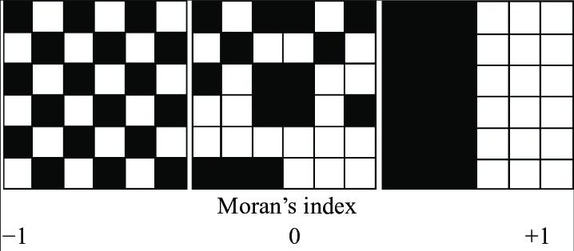

```{r setup, include=FALSE}
knitr::opts_chunk$set(echo = TRUE)
```

### Documentación

-   [Analyzing US Census Data - Kyle Walker](https://walker-data.com/census-r/)
-   [Spatial Machine Learning - J. Morgan](https://justinmorganwilliams.medium.com/spatial-machine-learning-29137dcd1f5f)
-   [Import and Map NYC Census data into R with tidycensus](https://justinmorganwilliams.medium.com/import-nyc-census-data-into-r-with-tidycensus-c94d2d1f23fa)

En $\textit{Analyzing US Census Data - Kyle Walker}$ se muestra como hacer uso de las librerías, entre ellas:

-   tidycensus : Paquete de R diseñado para facilitar procesos de adquirir y trabajar data de US Census, busca distribuir los datos del censo en un formado compatible con tidyverse, además busca agilizar el proceso del tratado de datos para aquel que esté trabajando en el analisis de datos. [Ch2.](https://walker-data.com/census-r/an-introduction-to-tidycensus.html)

-   tidyverse : Coleción de paquetes de R diseñados para la ciencia de datos tales como $\textit{ggplot2}$ para la visualización de data, $\textit{readr}$ para importar y exportar bases de datos, $\textit{tidyr}$ para la remodelación de datos, entre otros. [Ch3.](https://walker-data.com/census-r/wrangling-census-data-with-tidyverse-tools.html)

-   tigris : Paquete de R que busca simplificar procesos para los usuarios de obtención de información y uso de data con atributos geográficos (data espacial, Census geographic dataset), data tipo $\textit{sf}$ (simple features) viene con atributos de geometría (vector data type, tipicamente representados por puntos lineas o poligonos). [Ch5.](https://walker-data.com/census-r/census-geographic-data-and-applications-in-r.html)

-   ggplot2 : Paquete de R enfocado en la visualización de data, nos permite realizar mapas con información de US Census data. [Ch6.](https://walker-data.com/census-r/mapping-census-data-with-r.html)

### Spatial Data

Viene representada en formas como:

-   puntos (point reference data), i.e, ciudades en el mapa
-   lineas (line string), i.e, caminos en el mapa
-   poligonos (shapes) , i.e, distritos censales

\newpage

### Librerías

```{r, results='hide', warning=FALSE, message=FALSE}
library(tidycensus)
library(tidyr)
library(censusapi)
library(tmap)
library(ggplot2)
library(dplyr)
library(stringr)
library(units)
library(stats)
library(grDevices)
library(dotenv)
library(sf)
library(corrr)
library(spatialreg)
library(spdep)
```

\newpage

## Activacion API key

El siguiente código ejecuta la activación de la llave 'API Key' que nos permite descargar Census Data, mediante funciones como get_acs, el primer argumento es la llave utilizada en este código.

```{r, eval=FALSE}
census_api_key("6034739b488f5fc230e467601ed20256bb25831b", install = TRUE)
```

Este comando tiene la estructura

```{r, eval=FALSE}
census_api_key(key, overwrite = BOOL, install = BOOL)}
```

### Argumentos

-   key: La API Key entregada por el Censo, ingresar con "". Se obtiene en [API Census](https://api.census.gov/data/key_signup.html).

-   overwrite: Si está en TRUE, sobreescribirá sobre una ya existente CENSUS_API_KEY que tengamos instalado en nuestro archivo .Renviron

-   install: Si está en TRUE, instalará la llave en nuestro archivo .Renviron para las futuras sesiones, de no existir crea uno. Viene en FALSE por defecto.

Despues de instalada la llave, puede usarse en cualquier momento llamando el siguiente comando

```{r}
Sys.getenv("CENSUS_API_KEY")
```

Reload del enviroment para poder usar la llave sin tener que resetear R

```{r, eval=FALSE}
readRenviron("~/.Renviron")
```

## NY US Census data

Tomamos como caso de prueba al estado de New York, para visualizar el valor medio de las viviendas a nivel de condados, podemos variar el nivel geográfico con el parámetro $\textit{geography}$ (Walker K., 2023) [@walker2023a]

```{r, results='hide', warning=FALSE, message=FALSE}
# Creamos el objeto median_nyc que contiene la variable "median income"
# con nivel geografico condados(county).
medianincomenystate <- get_acs(geography = "county",
        state = "New York",
        geometry = TRUE, #descarga el componente espacial del tramo censal
        variable = "B19013_001" #median income 
        )
```

\newpage

### Tidycensus, funciones principales para obtener data

Para obtener datos de las distintas bases $\textit{tidycensus}$ ofrece las siguientes funciones

-   get_decennial() : Solicita datos de las API US Decennial Census para 2000, 2010 y 2020.

-   get_acs() : Solicita datos de las muestras de la American Community Survey de 1 y 5 años. Los datos están disponibles desde el ACS de 1 año hasta 2005 y el ACS de 5 años hasta 2005-2009.

-   get_estimates() : Interfaz para las Population Estimates APIs. Estos conjuntos de datos incluyen estimaciones anuales de las características de la población por estado, condado y área metropolitana, junto con componentes de estimaciones demográficas de cambio como nacimientos, muertes y tasas de migración.

-   get_pums() : Accede a los datos de ACS Public Use Microdata Sample APIs, Estas muestras incluyen registros anónimos a nivel individual de la ACS organizados por hogar y son muy útiles para muchos análisis de ciencias sociales, get_pums() se cubre con más profundidad en los Capítulos 9 y 10 de $\textit{Analyzing US Census data}$.

-   get_flows() : Interfaz para la ACS Migration Flows APIs. Incluye información sobre los flujos de entrada y salida de varias geografías para las muestras de ACS de 5 años, lo que permite realizar análisis de origen y destino

De manera más general, para ver que variables se pueden obtener, $\textit{tidycensus}$ nos provee de la función load_variables(), dicha función requiere de 2 argumentos, $\textit{year}$ que toma el año de referencia de la data, y $\textit{dataset}$.

Para el Decennial Census 2000 a 2010, usar "sf1" o "sf2", el 2020 Decennial Census tambien acepta "sf3" y "sf4", sf hace referencia a Summary Files.

Para variables de la American Community Survey, debemos especificar el año de la encuesta, por ejemplo "acs1" para el primer año de la ACS, por ejemplo si se quiere acceder a la data $\textit{5-year ACS}$

```{r, results='hide', warning=FALSE, message=FALSE}
load_acs = load_variables(year = 2020, dataset = "acs5")
```

\newpage

### Plot del estado New York

Comencemos a visualizar la información, probaremos primeramente con plot, y luego usaremos herramientas mas avanzadas que nos ofrecen los paquetes

```{r}
plot(medianincomenystate["NAME"])
```

\newpage

## Plot del valor medio de las viviendas en New York

### Map-making con ggplot2 y geom_sf

En $\textit{ggplot2}$ podemos plotear rapidamente objetos de tipo $\textit{sf}$ mediante geom_sf(), para entender la sintaxis realizamos el siguiente plot de el estimado de la variable "Median income New York".

```{r}
ggplot(data = medianincomenystate, aes(fill = estimate)) + 
  geom_sf()
```

\newpage

### Customizing ggplot2 maps

Podemos customizar nuestros plots en ggplot2, la estructura es la siguiente

```{r}
ggplot(data = medianincomenystate, aes(fill = estimate)) +
  geom_sf() +
  scale_fill_distiller(palette = "YlGnBu",
                       direction = 1) +
  labs(title = "Median income New York, 2016-2020",
       caption = "Data source: 2016-2020, US Census",
       fill = "Median income estimate") +
  theme_void()
```

Las funciones que acompañan la sintaxis nos permiten customizar nuestro plot en ggplot2.

-   scale_fill_distiller() : Nos permite especificar una paleta de colores de [ColorBrewer](https://colorbrewer2.org/#type=sequential&scheme=BuGn&n=3) en el plot.

-   labs() : Nos permite añadir título, caption, legend label en el plot.

-   theme_void() : Nos permite remover el fondo y la grilla cuadrícular.

\newpage

### Histograma del valor medio de las viviendas en el estado New York

```{r}
hist(medianincomenystate$estimate)
```

\newpage

### Map-making con tmap

La sintaxis en similar a la usada en $\textit{ggplot2}$, el objeto mapa se inicializa con la función tm_shape() y nos permite visualizar los distritos censales con tm_polygons()

```{r}
library(tmap)
tm_shape(medianincomenystate) + 
  tm_polygons()
```

\newpage

### Variables en tmap

Veamos nuevamente la variable "median income"

```{r}
library(tmap)
tm_shape(medianincomenystate) + 
  tm_polygons(col = "estimate")
```

\newpage

### Labels y otras opciones de diseño

Podemos añadir más variables y seguir personalizando nuestros plots, por ejemplo añadiendo histogramas por distintos tipos de clasificación, quantiles ("quantile"), equal intervals ("equal") y Jenks natural breaks ("jenks"), con tm_layout() nos permite customizar el estilo del mapa, del histograma y añadir leyendas.

```{r}
tm_shape(medianincomenystate) + 
  tm_polygons(col = "estimate",
              style = "jenks",
              n = 5, #num de intervalos
              palette = "Purples",
              title = "2016 - 2020 US Census",
              legend.hist = TRUE) +
  tm_layout(title = "NY State Median Income", 
            frame = FALSE,
            legend.outside = TRUE,
            bg.color = "grey80", #backgroundcolor
            legend.hist.width = 7)
```

\newpage

### NYC Median Income

Podemos trabajar con niveles geográficos de menor nivel, como condados y tracts, trabajamos la ciudad de New York, formado por ciertos condados.

```{r, results='hide', warning=FALSE, message=FALSE}
# Creamos el objeto medianincomenyc que contiene la variable "median income"
# con nivel geografico de tract.
medianincomenyc <- get_acs(geography = "tract",
        state = "New York",
        geometry = TRUE, #descarga el componente espacial del tramo censal
        variable = "B19013_001" #median income 
        )
```

Filtramos respecto de los condados que queremos visualizar, aquellos cerca de la ciudad de NY, usamos $\textit{tidyr}$ con la función separate(), de manera de poder filtrar los condados que nos interesan

El siguiente código nos permite crear nuevas columnas "tract" y "county", de manera que podemos filtra aquellos condados de interes con otras funciones, ademas usamos na.omit() para botar aquellos valores con NA y así limpiar la data

```{r, results='hide', warning=FALSE, message=FALSE}
medianincomenyc <- separate(medianincomenyc,
         NAME,
         into = c("tract", "county"),
         sep = ", ")

medianincomenyc <- medianincomenyc %>% filter(grepl('Bronx County|New York County|Queens County|Kings County|Richmond County', county))

medianincomenyc <- na.omit(medianincomenyc)
```

\newpage

### Plot con tmap de NYC sobre los ingresos promedios

```{r}
tm_shape(medianincomenyc) + 
  tm_polygons(col = "estimate",
              style = "equal",
              palette = "Purples",
              title = "2016 - 2020 US Census",
              legend.hist = TRUE) +
  tm_layout(title = "NYC Median Income by Census Tract", 
            frame = FALSE,
            legend.outside = TRUE,
            bg.color = "grey80", #backgroundcolor
            legend.hist.width = 7)
```

\newpage

## Spatial Machine Learning

Replicamos la simulación [Spatial Machine Learning, Justin Morgan Williams](https://justinmorganwilliams.medium.com/spatial-machine-learning-29137dcd1f5f), con el fin de entender los desafíos con los que se encuentra el Machine Learning con los datos espaciales, dicha simulación esta fuertemente basada en el capítulo 8 de [Analyzing US Census Data, Modeling US Census Data](https://walker-data.com/census-r/modeling-us-census-data.html)[@walker2023a], respecto de los desafíos al tratar datos espaciales, citando.

-   $\textit{Autocorrelación espacial}$ $\rightarrow$ autocorrelación debida a la similitud en la ubicación del componente espacial de los datos

-   $\textit{Heterogeneidad espacial}$ $\rightarrow$ datos que no siguen una distribución idéntica dentro del área de muestra

-   $\textit{Limited Ground Truth}$ $\rightarrow$ muchas variables explicativas, verdad de terreno limitada

-   $\textit{Multiple Scales and Resolutions}$ $\rightarrow$ puede existir en múltiples escalas y resoluciones

Si no se toman en cuenta, pueden tener efecto en la predicción de Machine Learning, entregando resultados que no son óptimos, la simulación trata los primeros 2 puntos, autoccorelación espacial y heterogeneridad espacial.

### Importando data

Importamos data de NYC US Census con $\textit{tidycensus}$

```{r, results='hide', warning=FALSE, message=FALSE}
#load package
library(dotenv)
library(sf)
library(tidycensus)
library(dplyr)

# set county variables, condados que forman NYC
nyc_counties <- c("Bronx","Kings","New York","Queens","Richmond")

# set list of census variables 

# variable list
variables <- c(
  median_value = "B25077_001",
  median_rooms = "B25018_001",
  median_income = "DP03_0062",
  total_population = "B01003_001",
  median_age = "B01002_001",
  pct_college = "DP02_0068P",
  pct_foreign_born = "DP02_0094P",
  pct_white = "DP05_0077P",
  pct_black = "DP05_0078P",
  pct_hispanic = "DP05_0070P",
  pct_asian = "DP05_0080P",
  median_year_built = "B25037_001",
  percent_ooh = "DP04_0046P"
)
```

\newpage

### Import usando get_acs()

Llamamos las variables antes definidas, en los condados que forman NYC usando get_acs()

```{r, results='hide', warning=FALSE, message=FALSE}
# get acs data y transforma a tipo NYC EPSG
nyc_census_data <- get_acs(
  geography = "tract",
  variables = variables,
  state = "NY",
  county = nyc_counties,
  geometry = TRUE,
  output = "wide",
  year = 2020,
  key = Sys.getenv("CENSUS_API")) %>% 
  st_transform(2263)

```

Las variables que importamos, que se corresponden a estimados que entrega la ACS sobre los condados de NY, son las siguientes:

-   median_valueE : El valor medio de la vivienda del tramo censal (nuestro outcome)

-   median_roomsE : Cantidad media de habitaciones por casa en el tramo censal

-   total_populationE : Población total

-   median_ageE : Edad media de la población en el tramo censal

-   median_year_builtE : Año promedio donde se construyó la vivienda

-   median_incomeE : Ingreso medio de los hogares en el tramo censal

-   pct_collegeE : Porcentaje de la población de 25 años o más con un título universitario de cuatro años

-   pct_foreign_bornE: Porcentaje de la población que nació fuera de EE.UU

-   pct_whiteE : Porcentaje de la población que se identifica como blanco no-hispano, se sigue la misma lógica con pct_blackE, pct_asian, pct_hispanic.

-   percent_oohE : El porcentaje de unidades de vivienda en el tramo censal que están ocupadas por sus propietarios.

Más detalles sobre la estructura del código se encuentran en la sección 8.2.1 (Data setup and exploratory data analysis), en el libro se toma la misma variable "median home value", pero que a diferencia de esta réplica, se toman los tramos censales en Dallas-Fort Worth metropolitan area, en consecuencia también cambian el código usando en st_transform, a un sistema de referencias apropiado para North Texas (code 32148), a diferencia del caso NYC donde usamos code 2263

\newpage

## Plot de la variable dependiente

Nuestra variable dependiente será el valor promedio de la vivienda en NYC.

```{r, results='hide', warning=FALSE, message=FALSE}

# plot tmap
(nyc_median_value_hist_tm <- nyc_census_data[!st_is_empty(nyc_census_data),,drop=F] %>% 
tm_shape() +
  tm_polygons(col = "median_valueE",
          palette = "cividis",
          title = "2016-2020 ACS",
          legend.hist = TRUE,
          legend.format = scales::dollar_format()) +
  tm_layout(main.title = "NYC Median Home Value by Census Tract",
            frame = FALSE,
            legend.outside = TRUE,
            bg.color = "grey100",
            legend.hist.width = 5,
            ))

# save plot
tmap_save(nyc_median_value_hist_tm, "nyc_median_value.png", width=1920, height=1080, asp=0)

```

\newpage

Notamos en el histograma que se presenta una asimetría a la derecha, existe una población no menor cuyos hogares perciben ingresos mucho mayores a la mediana, y vemos que existe data perdida, para el primer punto, podemos aplicar una transformación a la variable dependiente, tomando su raiz cuadrada para reducir esta asimetría a la derecha y tener los datos mejor distribuidos, acercándose más a una distribución normal, y en consecuencia, entregando resultados más precisos.

### Transformación de los datos

Creamos la nueva variable tomando la raiz cuadrada de la variable dependiente median_valueE

```{r, results='hide', warning=FALSE, message=FALSE}

# create plot
(nyc_median_value_sqrt_hist_tm <- nyc_census_data[!st_is_empty(nyc_census_data),,drop=F] %>% #limpiamos datos vacios
   mutate(sqrt_med_value = sqrt(median_valueE)) %>% #variable_sqrt
tm_shape() +
  tm_polygons(col = "sqrt_med_value",
          palette = "cividis",
          title = "2016-2020 ACS (sqrt)",
          legend.hist = TRUE) +
  tm_layout(main.title = "NYC Median Home Value by Census Tract",
            frame = FALSE,
            legend.outside = TRUE,
            bg.color = "grey100",
            legend.hist.width = 5,
            ))

# save plot
tmap_save(nyc_median_value_sqrt_hist_tm, "nyc_median_value_sqrt.png", width=1920, height=1080, asp=0)
```

\newpage

### Preparando la data para modelar

Debemos borrar aquellas variables con data NA, y eliminar columnas con información del margen de error eliminando las columnas que terminan con "M", se le quita la E final a las columnas como median_valueE y se añaden las variables pop_density y median_structure_age, esto pues buscamos transformar los predictores de manera que se represente mejor la relación que tiene con la variable de salida (en este caso, median_value)

-   pop_density $\rightarrow$ mide densidad de población por metros cuadrados

-   median_structure_age $\rightarrow$ resta 2020 de median_year_built

```{r, warning=FALSE, message=FALSE}
# load packages
#library(dplyr)
#library(stringr)
#library(units)
#library(stats)

# prep data for model
nyc_census_data_prepped <- nyc_census_data %>% 
  mutate(pop_density = as.numeric(set_units(total_populationE / st_area(.),
 "1/km2")),
         median_structure_age = 2020 - median_year_builtE) %>% 
  select(!ends_with("M")) %>% # drop margin of error cols
  rename_with(.fn = ~str_remove(.x, "E$")) %>% # remove E from col name
  na.omit() # omit NA

nyc_census_data_prepped
```

\newpage

## Modelo SLR y Spatial Autocorrelation

En esta sección pasaremos al desarrollo de modelos de predicción, para ello replicamos los modelos de predicción hecho en [Spatial Machine Learning, Justin Morgan Williams](https://justinmorganwilliams.medium.com/spatial-machine-learning-29137dcd1f5f) y además, complementamos con el Capítulo 8 del libro [Analyzing US Census Data - Modeling US Census Data](https://walker-data.com/census-r/modeling-us-census-data.html) (Walker K., 2023)[@walker2023a] , capítulo donde se estudian conceptos durante la primera sección como indices de segregación y diversidad los cuales son usados en ciencias sociales para explicar patrones demográficos, en la segunda sección se estudian tópicos en modelamiento estadístico, incluyendo métodos de regresión con atributos espaciales, en donde tomamos en cuenta conceptos como la autocorrelación espacial que está inherente en la mayoría de las variables del censo; en la tercera sección del capítulo se estudian conceptos como clasificación, clusterización y regionalización, que son comunes en técnicas de Machine Learning. Nos enfocamos en particular en la segunda sección del capítulo.

### Simple Linear Regression

Con la data preparada, podemos crear el primer modelo sencillo de regresión lineal, con la variable dependiente, la raiz cuadrada del valor medio de la vivienda ("NYC Median Home Value")

```{r}
# model formula
formula <- "sqrt(median_value) ~ median_rooms + median_income + 
pct_college + pct_foreign_born + pct_white + pct_black + pct_hispanic + 
pct_asian + median_age + percent_ooh + median_structure_age + pop_density"

# compute model
model1 <- lm(formula = formula, data = nyc_census_data_prepped)

# view model statistics
summary(model1)
```

Aquellas variables con mayor p-value son pct_foreign_born, median_age, pop_density, un p valor alto nos dice que la variable no tiene mucha significancia en el resultado (típicamente pedimos que sea menor a 0.05 para que la variable se considere significativa), notamos tambien que las primeras dos variables se correlacionan negativamente con median_value, es decir, a mayor cantidad de nacidos extranjeros y edad promedio, se tiene que el valor medio de la vivienda disminuye. Al contrario, si aumenta la densidad poblacional, notamos que el valor medio de la vivienta aumenta, podemos ver tambien el valor $R^2$ el cual nos dice que un $0.4757$% de la varianza de median_value es explicado con las variables del modelo (el modelo es deficiente).

En la regresión lineal, los errores no son independientes en un modelo con componentes espaciales, esto es porque la autocorrelación espacial está presente en el error, lo que nos dice que el performance del modelo depende de la posición geográfica.

\newpage

Haciendo uso de la librería $\textbf{corrr}$ podemos calcular la matriz de correlaciones [@walker2023a]

```{r, warning=FALSE, message=FALSE}
library(corrr)

nyc_estimates <- nyc_census_data_prepped %>%
  select(-GEOID, -median_value, -median_year_built) %>%
  st_drop_geometry()

correlations <- correlate(nyc_estimates, method = "pearson")
```

Y lo visualizamos haciendo uso de network_plot()

```{r}
network_plot(correlations)
```

\newpage

Nos interesa además los residuos del modelo, pues esperamos que estos sean explicados cuando tomamos en cuenta el fenómeno de spatial autocorrelation , para obtenerlos y añadirlos a nuestra data, seguimos como en la sección 8.3 de Analyzing US Census Data

```{r}
#Añadimos los residuos a la data que estamos trabajando
nyc_census_data_prepped$residuals <- residuals(model1)

#Plot
ggplot(nyc_census_data_prepped, aes(x = residuals)) + 
  geom_histogram(bins = 100, alpha = 0.5, color = "navy",
                 fill = "navy") + 
  theme_minimal()
```

Usaremos esta variable para realizar posteriormente un Test de Índice de Moran, para ello necesitamos hablar sobre lo que es Spatial data, el fenómeno de Spatial autocorrelation y el índice de Moran.

\newpage

### Spatial data

Lo definimos como un conjunto de observaciones de data espacial (Jiang Z., 2019) [@8444678] $$\{(x(s_i),y(s_i)) | \ i \in \mathbb{N} , 1 \leq i \leq n\}$$ donde $n \in \mathbb{N}$ es la cantidad de muestras, $s_i \in \mathbb{R}^{2 \times 1}$ es un vector de coordenadas espaciales, $x(s_i) \in \mathbb{R}^m$ son las variables explicativas del modelo y $y(s_i) \in \mathbb{R}$ es la respuesta a dichas variables donde nuestra intención es predecir $y$.

Este mismo conjunto también puede ser descrito en formato matricial como $(X,Y) \in \mathbb{R}^{(m+1) \times n}$  donde $X = [x(s_1), x(s_2), \dots, x(s_n)]^{T} \in \mathbb{R}^{m \times n}$ (ya que $x(s_i) \in \mathbb{R}^{m}$) y $Y = [y(s_1), y(s_2), \dots, y(s_n)]^{T} \in \mathbb{R}^{n}$.

Por lo tanto, dado un conjunto de muestras de data espacial, buscamos modelar una función $f$ tal que $Y = f(X)$, una vez que el modelo se entrena, puede usarse para precedir $y(s_i)$ dado $x(s_i)$.

La predicción espacial (Spatial prediction) tiene una cualidad única que la diferencia de la predicción usual en data mining en donde se asume que las muestras son independientes e identicamente distribuidas (i.i.d) y por lo tanto dado un modelo reflejado en la función $f$ podemos usarlo para predecir $y(s) = f(x(s))$ para todo $s$, sin embargo la suposición de que los datos son i.i.d no se cumple bajo la data espacial debido a la relación espacial implícita que existe entre posiciones cercanas en una región.

"Todo se relaciona con todo lo demás, pero las cosas más cercanas se relacionan más que las cosas distantes", primera ley de la geografía (Tobler W.R, 1970) [@tobler1970]

### Spatial Autocorrelation

Usando spatial data recolectada, notamos que locaciones cercanas tienden a parecerse entre sí en lugar de ser estadísticamente independientes, llamamos a este fenomeno como efecto de autocorrelación, lo que hace que las muestras nos sean i.i.d, ignorar este factor puede producir modelos menos precisos, por ejemplo cuando aplicamos un modelo de regresión lineal, el error residual esta comunmente correlacionado.

La primera ley de geografía (Tobler W.R, 1970) [@tobler1970] nos indica que en muestras con spatial data, estas no son estadísticamente independientes, si no que se encuentran correlacionadas, en particular sobre locaciones cercanas entre sí.

\newpage

### Índice de Moran

Para trabajar el problema de la autocorrelación espacial [@8444678] hacemos uso del índice de Moran el cual el cual nos entrega una medida de como se comporta este fenómeno dado n observaciones de una variable, el índice de Moran es una auto-covarianza espacial estandarizada [@chen2013].

Definimos el índice de Moran como $$I = \frac{\sum_{i=1}^{n} \sum_{j=1}^{n} w_{ij} (y(s_i) - \bar{y})(y(s_j) - \bar{y})}{(\sum_{i=1}^{n} \sum_{j=1}^{n} w_{ij}) \sum _{i=1}^{n} (y(s_i) - \bar{y})^2 /n }$$

O de manera equivalente

$$= \frac{n}{W}\frac{\sum_{i=1}^{n} \sum_{j=1}^{n} w_{ij} (y(s_i) - \bar{y})(y(s_j) - \bar{y})}{\sum _{i=1}^{n} (y(s_i) - \bar{y})^2}$$ donde $\bar{y} = \sum_{i=1}^{n} y(s_i)/n$ con $n$ el número total de muestras, a partir de ahora, para simplificar la notación, $y(s_i) = y_i$, además $W = \sum_{i=1}^{n} \sum_{j=1}^{n} w_{ij}$, y abusando de la notación, $W = (w_{ij})_{i,j = 1}^{n}$, que consideramos como una matriz de pesos.

Veamos que, bajo ciertas condiciones de la matriz $W$, se tiene que $I \in [-1,1]$, en (Chen, Y. 2022)[@chen2022] tenemos una demostración de que el índice de Moran toma dichos valores cuando $W$ clasifica como "globally normalized wight matrix", pero no entra en detalles, además, se estudia que en la práctica muy típicamente para estas matrices, $I \in (-1,1)$, en el [manual de PQStat](https://manuals.pqstat.pl/en:przestrzenpl:mwagpl) se habla de "Spatial weights matrix" como una matriz con coeficientes positivos y filas estandarizadas de manera las filas sumen uno, esto es $\sum_{j=1}^{n} w_{ij} = 1 \ \ \forall i \in \{1,\dots,n\}$ ($\textit{row-normalized}$).

En la discusión ["Why is Moran's I coming out greater than 1" - StackExchange](https://stats.stackexchange.com/questions/160459/why-is-morans-i-coming-out-greater-than-1) se muestra un contraejemplo de matriz $W$ cuya suma de las entradas es $\sum_{i,j}^{n} w_{ij} = 1$ y para muestras $(X_1,\dots,X_4)$ sucede $I = 3$, por lo que si $W$ no cumple la propiedad de ser $row-normalize$, no se puede saber a primeras los valores que puede tomar $I$, y por tanto, no tenemos una referencia clara de la significancia que pueda tener la magnitud de $I$ en el modelo si no conocemos sus valores máximos y mínimos.

Veremos que se puede relajar la condición de que la suma de las filas sean todas iguales a $1$ y pediremos que la suma de las filas sea un número $\alpha$ para cada fila, trabajaremos entonces con matrices de pesos estandarizadas que son las adecuadas para un modelo de autocorrelación

\newpage

Presentamos una demostración en la que no usaremos técnicas de cálculo ni de optimización para probar que para $W$ una matriz de pesos estandarizada, tenemos que $I \in [-1,1]$

Entenderemos por matriz de pesos estandarizada aquella que cumple las siguientes propiedades

-   Supondremos $w_{ij} \geq 0 \ \  \forall i,j \in \{1, \dots, n\}$, pues w_{ij} es una magnitud de la influencia que hay entre los vecinos $i$ y $j$

-   Típicamente, $w_{ii} = 0 \ \ \forall i \in \{1, \dots, n\}$, pues el hecho de tener que un punto tenga influencia con el mismo puede generar ruido en el modelo

-   Suponemos que la influencia que tiene $y_{i}$ sobre $y_{j}$ es la misma que la de $y_{j}$ sobre $y_{i}$, esto es, $w_{ij} = w_{ji} \ \ \forall i,j \in \{1, \dots, n\}$, es decir, $W$ es simétrica

-   \textit{Row-normalized:} Para cada $i \in \{1,\dots,n\}$ se tiene que $\sum_{j=1}^{n} w_{ij} = \alpha$ para algún $\alpha \in \mathbb{R}$, esto pues, entendemos la suma $\sum_{j=1}^{n} w_{ij}$ como la influencia total que existe entre el vecino $i$ y todos sus vecinos $j$, por lo que pedimos que la influencia total sea la misma para cada vecino $i \in \{1,\dots,n\}$, de manera que el nivel de influencia esté estandarizado para cada vecino.

\newpage

Haremos uso de los siguientes resultados conocidos

-   $\textbf{Teorema:}$ Sea $A$ una matriz cuadrada simétrica a coeficientes reales, tenemos que $A$ es ortogonalmente diagonalizable, es decir, podemos escribir $A = PDP^{T}$, con $P$ matriz ortogonal cuyos vectores columna son los vectores propios de $A$ y $D$ es matriz diagonal con $(d_{ii})_{i=1}^{n} = (\lambda_{i})_{i=1}^{n}$ valores propios de $A$

-   $\textbf{Lema:}$ Si $P$ es ortogonal, entonces $P^T = P^{-1}$ y además, $P$ es una isometría en $(\mathbb{R}^{n} , || \cdot ||_{2})$, es decir, $||Pw||_{2} = ||w||_{2}$ $\ \ \forall w \in \mathbb{R}^{n}$

Con ello, podemos probar el siguiente teorema

-   $\textbf{Teorema:}$ Se tiene que el operador $\lambda_{max}: S^n \rightarrow \mathbb{R}$ , que asocia a cada $A \in S^n$ matriz simétrica su mayor valor propio $\lambda_{max} (A)$, es convexa, más aún, $\lambda_{max}(A) = \sup_{||v||=1} v^{T}Av$ supremo de funcionales lineales sobre $S^n$.

Además haremos uso del siguiente lema

-   $\textbf{Lema:}$ El mayor valor propio de una matriz $A$ con coeficientes no negativos está acotada por la mayor suma de las filas, esto es, $\lambda_{max} (A) \leq \max_{i} \sum_{j=1}^{n}a_{ij}$.

- $\textbf{Demostración del lema}$: Sea $\lambda$ un valor propio de una matriz $A$ no negativa asociada a un vector $x$, tenemos entonces que 

$$Ax=\lambda x \implies \lambda |x_i| = |\sum_{j=1}^{n}a_{ij}x_j| \ \ \forall i \in \{1,\dots,n\}$$
$$\implies \lambda |x_i| = |\sum_{j=1}^{n}a_{ij}x_j| \leq (\sum_{j=1}^{n} |a_{ij}|) \max_{j} |x_j| \ \ \forall i \in \{1,\dots,n\}$$

Usando que $a_{ij} \geq 0 \ \ \forall i,j \in \{1,\dots,n\}$ y que la desigualdad se cumple para todo $i$ tenemos

$$\lambda \max_{i} |x_i| \leq \max_{i} (\sum_{j=1}^{n} a_{ij} \max_j |x_j|) = \max_{i}(\sum_{j=1}^{n} a_{ij}) \max_{j} |x_j|$$

$$\implies \lambda \leq \max_{i} (\sum_{j=1}^{n} a_{ij})$$

Como $\lambda$ era arbitrario deducimos que 

$$\lambda_{max}(A) \leq \max_{i}(\sum_{j=1}^{n} a_{ij})$$

\newpage

Enunciamos entonces

* $\textbf{Propiedad:}$ Para $I= \frac{n}{W}\frac{\sum_{i=1}^{n} \sum_{j=1}^{n} w_{ij} (y_i - \bar{y})(y_j - \bar{y})}{\sum _{i=1}^{n} (y_i - \bar{y})}$ donde $\bar{y} = \sum_{i=1}^{n} y_i/n$ con $W$ matriz de pesos estandarizada e $y \in \mathbb{R}^{n}$, se cumple que $I \in [-1,1]$.

* $\textbf{Demostración:}$ Consideremos el operador $\Phi : \mathbb{R}^{n} \rightarrow \partial B(0,1)$ definido por $\Phi(y) = z =(z_i)_{i=1}^{n} = (\frac{(y_i - \bar{y})}{\sqrt(\sum_{i=1}^{n}(y_i - \bar{y})^{2})})_{i=1}^{n}$

Está bien definida pues $\forall y \in \mathbb{R}^n$

$$||\Phi(y)||_{2} = ||z||_{2} = \sum_{i=1}^{n} |z_i|^2 = \sum_{i=1}^{n} \frac{(y_i - \bar{y})^2}{\sum_{i=1}^{n} (y_i - \bar{y})^2}$$ 

$$= \frac{\sum_{i=1}^{n} (y_i - \bar{y})^2}{\sum_{i=1}^{n} (y_i - \bar{y})^2} = 1$$

Notamos que

$$I = \frac{n\sum_{i=1}^{n} \sum_{j=1}^{n} w_{ij}(y_i - \bar{y})(y_j - \bar{y}))}{W (\sum_{i=1}^{n} (y_i - \bar{y})^2)}$$

$$= \frac{n}{W} \sum_{i=1}^{n} \sum_{j=1}^{n} w_{ij} \frac{(y_i - \bar{y})(y_j - \bar{y})}{\sqrt{\sum_{i=1}^{n}(y_i - \bar{y})^2} \sqrt{\sum_{i=1}^{n}(y_i - \bar{y})^2}}$$

$$\frac{n}{W} \sum_{i=1}^{n} \sum_{j=1}^{n} w_{ij} \Phi (y_i) \Phi (y_j) = \frac{n}{W} \sum_{i=1}^{n} \sum_{j=1}^{n} w_{ij} z_i z_j$$

Definimos $V = (\frac{w_{ij}}{W})_{i,j}^{n}$ matriz normalizada tal que $\sum_{i,j} v_{ij} = 1$, además, como W es matriz de pesos estandarizada, tenemos que $V$ también lo es, por lo que es simétrica, no negativa, y row-normalized.

Entonces, recordando que $||z||_{2} = 1$

$$I = n(z^{T}Vz) \leq n \sup_{||z||=1} z^{T}Vz = n\lambda_{max}(V)$$

$$\implies |I| \leq n |\lambda_{max}(V)| \leq n |\max_{i}(\sum_{j=1}^{n} v_{ij})| \leq n \max_{i} (\sum_{j=1}^{n}|v_{ij}|)$$

Por un lado, tenemos que $|v_{ij}| = v_{ij}$ y como $\sum_{i=1}^{n} \sum_{j=1}^{n} v_{ij} = 1$ y $V$ es $\textit{row-normalized}$ tenemos que se cumple $\sum_{j=1}^{n} v_{ij} = \frac{1}{n} \ \ \forall i \in \{1,\dots,n\}$, y por lo tanto

$$\implies |I| \leq n\max_{i}(\sum_{j=1}^{n} v_{ij}) = n *\frac{1}{n} = 1$$

$$\implies I \in [-1,1]$$

\newpage

En caso de que $W$ no cumpla la propiedad $\textit{row-normalized}$ de igual manera podemos encontrar una cota para $I$ y esta es $I \in [-n,n]$ donde $n$ es la cantidad total de datos haciendo uso de la desigualdad de Schur [@ikramov1994] que nos dice

* $\textbf{Teorema:}$ Sea $A$ una matriz $n \times n$ con valores propios $(\lambda_1,\dots,\lambda_n)$, entonces se cumple

$$\sum_{i=1}^{n} |\lambda_i|^{p} \leq \sum_{i,j = 1}^{n} |a_{ij}|^{p} \ \ , 1 \leq p <2$$

Luego, como vimos antes, tenemos ahora $V$ una matriz normalizada, pero no necesariamente $\textit{row-normalized}$, luego

$$I = n (z^{T}Vz)$$
Y como $V$ es simétrica, la escribimos como $V=P^TDP$ usando el teorema espectral, y como $P$ es ortogonal, entonces $x = Pz$ tiene norma $||Pz||_{2} = ||x||_{2} = 1$, en particular $|x_i|^2 \leq 1 \ \ \forall i \in \{1,\dots,n\}$ luego

$$I = n(z^TP^T D Pz) = n(x^TDx) = n \sum_{i=1}^{n} \lambda_{i}(V) |x_{i}|^2$$
$$\implies |I| \leq n \sum_{i=1}^{n} |\lambda_i (V)| \leq n \sum_{{i,j = 1}}^{n} |v_{ij}| = n $$
$$\implies I \in [-n,n]$$

Sin embargo, usaremos matrices de peso estandarizadas pues son las que mejor se ajustan al modelo, y donde sabemos que el índice de Moran se mueve entre $[-1,1]$.

Si sabemos el intervalo en el que se mueve $I$ para nuestro modelo, podemos saber que tan significativo es el valor, y por lo tanto que tan presente esta el fenómeno de autocorrelación espacial.

Comentando sobre el significado de este valor, al igual que la correlación, en donde vemos la relación entre 2 variables de entrada cuando vemos el cambio que tienen respecto de una variable de respuesta, la autocorrelación es similar pero la variable de respuesta es la misma variable de entrada [(Fuente)](https://www.statisticshowto.com/morans-i/).

\newpage

El índice de Moran mide que tan similar es una variable respecto de las variables cercanas, por ejemplo, si este se acerca a $-1$ nos dice que cada variable tiende a tener valores distinto de sus alrededores, y caso contrario si se acerca a $1$, resumiendo

* $I \approx -1 \rightarrow$ Se clusterizan valores distintos entre sí (dispersión perfecta)

* $I \approx 0 \rightarrow$ No existe autocorrelación espacial (podemos pensar que los datos son independientes identicamente distribuidos en el espacio)

* $I \approx 1 \rightarrow$ Se clusterizan valores similares entre sí

```{r, echo = FALSE, fig.align = 'center'}

```

\newpage

### Spatial Weights Matrix

Seguimos el modelo, para esta parte nos guiamos con el capítulo 7 [Analyzing US Census Data - Spatial analysis with US Census Data](https://walker-data.com/census-r/spatial-analysis-with-us-census-data.html)

Buscamos armar una matriz de pesos, para medir la interacción entre cada tramo censal, para ello generamos una "neighborhood list" en R con el paquete $\textbf{spdep}$ usando la función poly2nb(), esta función nos presenta varias formas de catalogar a los vecinos, para el modelo usaremos

-   $\textit{Contiguity-based neighbors} \rightarrow$ se usa cuando la geometría es tipo polygon, las opciones incluyen neighbors tipo "Queen", que se basa en que todos los polygons que compartan un vértice se consideren vecinos, y neighbors tipo "Rook", en donde deben compartir al menos un segmento de linea para ser vecinos, podemos inferir que neighbors tipo "Queen" abre diagonales de manera que tiene menos entradas iguales a cero

```{r, results='hide', warning=FALSE, message=FALSE}
# create neighbor list object
nyc_nb <- spdep::poly2nb(nyc_census_data_prepped, queen = TRUE)
nyc_nb
```

Interpretamos la información de la siguiente manera

-   Tenemos 1967 distritos censales en NYC (aquellos con valor NA se omiten)

-   El porcentaje de las entradas $w_{i,j}$ tales que $w_{i,j} \neq 0$ es $0.2765$%

-   El número promedio de conexiones entre distritos censales, el promedio de cuantas conexiones posee cada distrito es $5.439756$

-   Existen 5 distritos que no se conectan con nadie.

Podemos hacer un plot de la estructura que posee el objeto "neighborhood list"

\newpage

Para visualizarlo usamos funciones st\_ descritas en Analyzing US Census.

```{r, results='hide', warning=FALSE, message=FALSE}

# filter for si
si <- nyc_census_data_prepped[str_detect(nyc_census_data_prepped$NAM, "Richmond"),]

# store geometry of polygons
si_geom <- st_geometry(si)

# centroid de cada tramo censal
si_centroids = st_centroid(si_geom)
si_coordinates = st_coordinates(si_geom)

# create neighbor list
si_nb_queen <- spdep::poly2nb(si)
si_nb_rook <- spdep::poly2nb(si, queen=FALSE)

# save plot as jpeg
jpeg("si_neighborhood_rook_queen.jpg", width = 1000, height = 800)

# set plot structure, 2 plots en la misma imagen
par(mfrow = c(1,2))

# plot queen
plot(si_geom,
     main = "Queen",
     reset = FALSE,
     cex.main = 3)
plot(si_nb_queen, si_centroids,
     add = TRUE,
     col = 2,
     lwd = 1.5)

# plot rook
plot(si_geom,
     main = "Rook",
     reset = FALSE,
     cex.main = 3)
plot(si_nb_rook, si_centroids,
     add = TRUE,
     col = 2,
     lwd = 1.5)

# close jpeg
dev.off()

```

\newpage

Guardada la imagen con las conexiones entre cada distrito censal con los modelos "Queen" y "Rook" procedemos a mostrar los plots.

```{r, echo = FALSE, fig.align = 'center'}
knitr::include_graphics("si_neighborhood_rook_queen.jpg")
```

En efecto, observamos la presencia de conexiones diagonales para el modelo "Queen" a diferencia de la estructur de "Rook", así como en ajedrez, la reina puede moverse en todas direcciones, mientras que la torre solo puede moverse en vertical y horizontal. \newpage

### Test de Índice de Moran

Dadas la "neighborhood list" antes dada, podemos usarla para crear una matriz de pesos $W$ usando la función de spdep nb2listw(), además para realizar el test de Índice de Moran, necesitamos ignorar aquellos datos que no posean vecinos, para ello usamos la librería spatialreg para verificar que se tiene activado la opción zero.policy que nos permite ignorar estos datos.

```{r, results='hide', warning=FALSE, message=FALSE}
# create spatial weights matrix
library(spatialreg)
library(spdep)
set.VerboseOption(TRUE)
get.VerboseOption()
set.ZeroPolicyOption(TRUE)
get.ZeroPolicyOption()
wts <- spdep::nb2listw(nyc_nb, zero.policy = TRUE)
```

Y con ella podemos realizar un test de Índice de Moran para observar autocorrelación espacial, para ello hacemos uso de la variable de residuos obtenida en secciones anteriores

```{r}
# perform Moran's I test 
spdep::moran.test(nyc_census_data_prepped$residuals, wts)
```

Notamos el p-value $< 2.2e-16$ lo que nos habla de la significancia que posee en el modelo

Además, vemos que el índice de Moran tiene un valor positivo, lo que nos dice que en el mapa, distritos censales con atributos similares tienden a agruparse (clusters).

En efecto, podemos apreciar como en NYC, con la variable "Median Home Value" se forman agrupaciones de distritos en ciertos sectores del estado que comparten la cualidad de tener un alto valor de la vivienda, y a su vez, otros sectores con distritos que comparten tener un bajo nivel de la vivienda.

Un índice de Moran de $I = 0.3232$ es estadísticamente significativo (Walker K., 1970)[@walker2023a]

\newpage

Observamos los residuos, hacemos uso de la función lag.listw() la cual nos toma en cuenta los residuos del modelo junto a la matriz de peso que estamos añadiendo.

```{r, warning=FALSE, message=FALSE}
# get lagged version of residuals for plot
nyc_census_data_prepped$lagged_residuals <- 
lag.listw(wts, nyc_census_data_prepped$residuals)

# plot
(morans_i_res <- nyc_census_data_prepped %>% 
ggplot(aes(x = residuals, y = lagged_residuals)) + 
  theme_minimal() + 
  geom_point(alpha = 0.5) + 
  geom_smooth(method = "lm", color = "red"))

# save image
ggsave("image/morans_i_res.png",
       plot = morans_i_res)
```

El plot muestra una correlación positiva entre el fenómeno de autocorrelación espacial y los residuos, lo que sugiere rechazar la independencia en los términos del error pues existe autocorrelación espacial en los residuos.

Para trabajar este problema, tenemos métodos para tratar con regresión espacial

\newpage

## Spatial Regression Model

### Simultaneous Autoregressive (SAR) models

\newpage

## Referencias

::: {#refs}
:::
